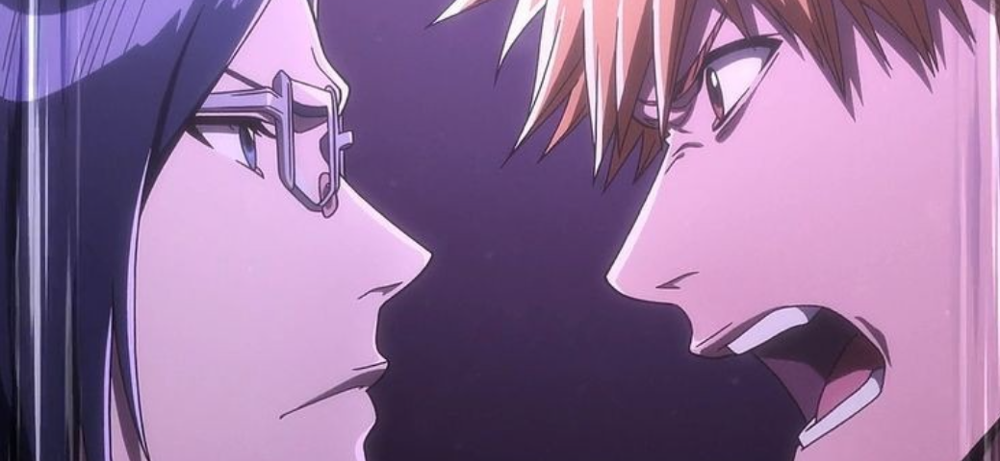
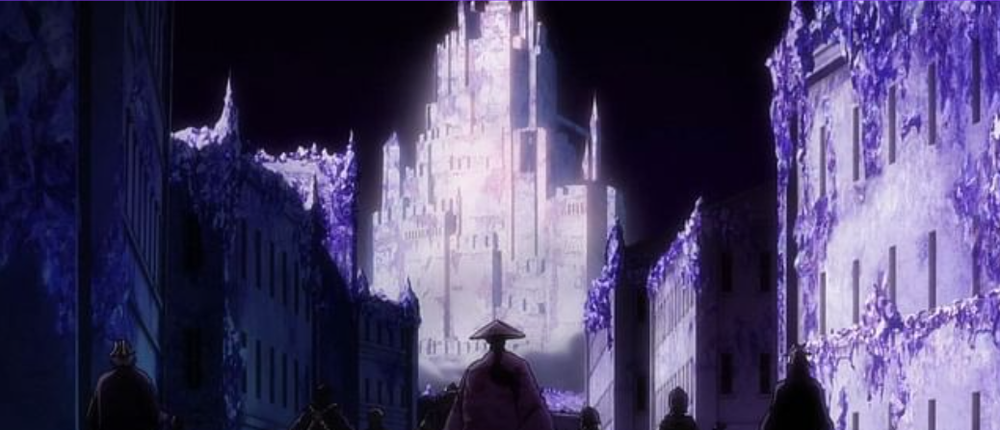
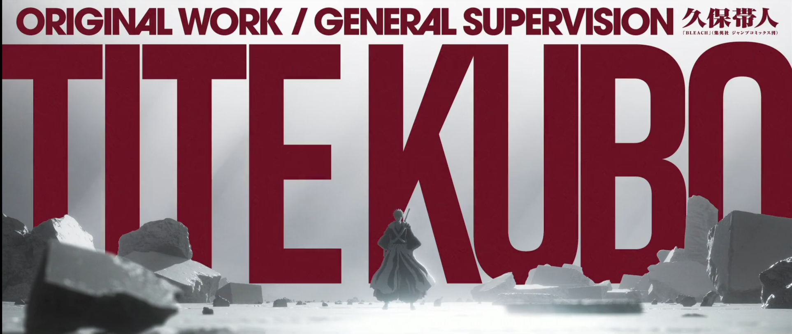
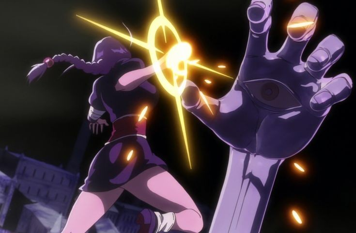

## Introduction

New year's first post! And we are covering Bleach:TYBA Cour 3, and for this post I've gotten some of my nerdy friends! So do check out their comments and thoughts.

Why this post? Well Cour 3 in terms of Production is special in many ways and the way it was handled, as someone who follows anime production even if little and specifically STUDIO PIERROT, I was looking forward to what they brought on table and for me this was a great start on the journey they want to go! As an anime only I am enjoying the story since watching the original animation to what they have been doing TYBW with Colors and Visual Identity of world of Bleach.

## Pierrot Films

For me the personal excitement part was the “Pierrot Films”. When Yoshihiko Tominaga (one of the producers in Pierrot Studios) announced that they are rebranding and establishing a new Studio with “Pierrot Films” name, mostly no-one was excited because this type of thing happens alot, what made me excited was their comments regarding how they recognise the level of animation expected by general viewer has gotten high and they are lacking on that part, and also the fact that they are trying to reach the level of what Mappa and UFOTABLE are doing with their anime productions.

Seeing as how SP is somewhat of a silent studio (regarding how they don't push much of their socials, which might be common idk), It was good to see them recognising their shortcomings and trying to improve on it, which is visible in Cour 3!

## Kubo Sensei’s Involvement

Before coming to other production stuff, I wanna say I've never seen any Creator involved in any production the way Kubo Sensei has been involved in the production of TYBW, specially with Cour 3 and upcoming Cour 4. Kubo Sensei has been active on his group chat thingy he runs and time to time provides what he contributed or worked on for the anime original content, after every episode dropped he would go on and share things for that episode, answering QnA and stuff regarding anime original material.

Best part of watching Cour 3 opening was seeing the “Tite Kubo”, big and bold! Seeing as how the original anime somewhat ruined many moments of manga and sometimes core of the story (according to manga readers) now him coming out and giving direction to production team makes me feel good, and also the way studio with new approach is involving and improving on what Kubo Sensei shares regarding every scene. I personally feel like this how every manga creator should be treated when it comes to anime adaption.

## Added CGI

Coming to production along the way when Pierrot Films was announced there was also a bit about how Pierrot will be having strategic and business deals with other Studios regarding production quality. One of these collaboration was Asahi Production, who were responsible for Pernida’s transformation. Which was all 3D work although there were complains but overall for the starters that was done well, this is something that can be improved.

One the CGI highlight for me was Wahrwelt, whole structure was done on CGI and considering a lot of Episodes and fight were gonna take place in this environment, they really perfected it, whole model, the texture, the lighting everything and then integrating characters in it and moments like Schutzstaffel’s Schrift or Bankai or any battle all these were enhanced by the way whole Wahrwelt was built.

## Conclusion

Overall I'm really happy with the way this part of the story was adapted, Cour 1 is still highly regarded because of the all talent involved and the way it was adapted! Compared to that Cour 2 was a slight downgrade and then coming to Cour 3 with different Production approach although there is alot to improve on I think Pierrot is in right direction! Consistency in this Cour was also something to appreciate. And with Kubo Sensei’s comments on how he is approaching Cour 4 with anime original content with whole episodes is something I'm excited about!
