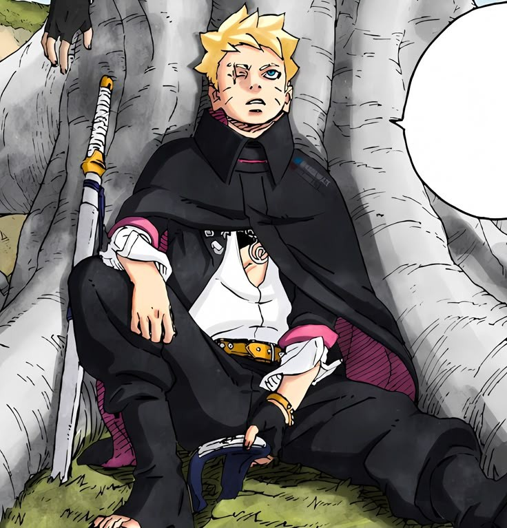
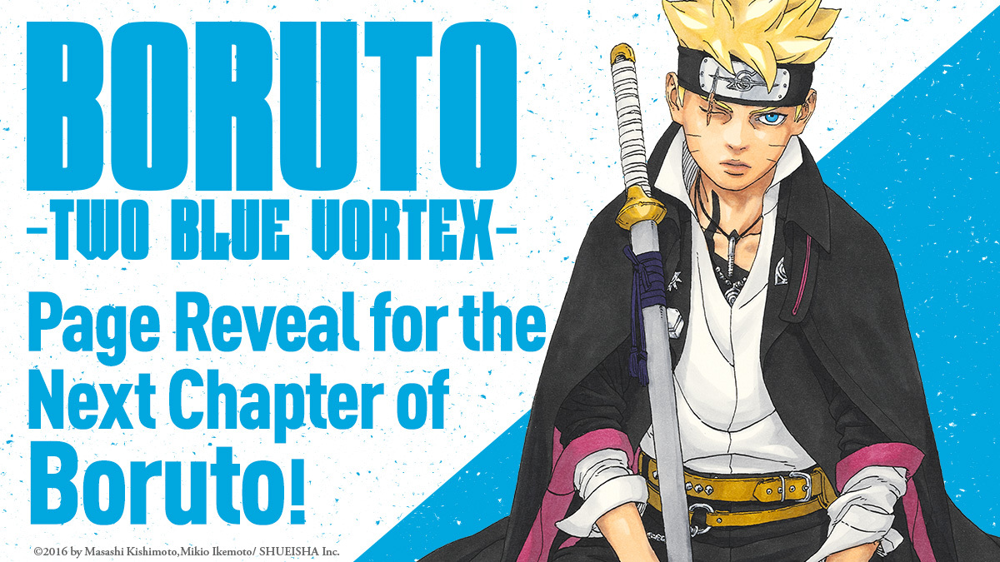
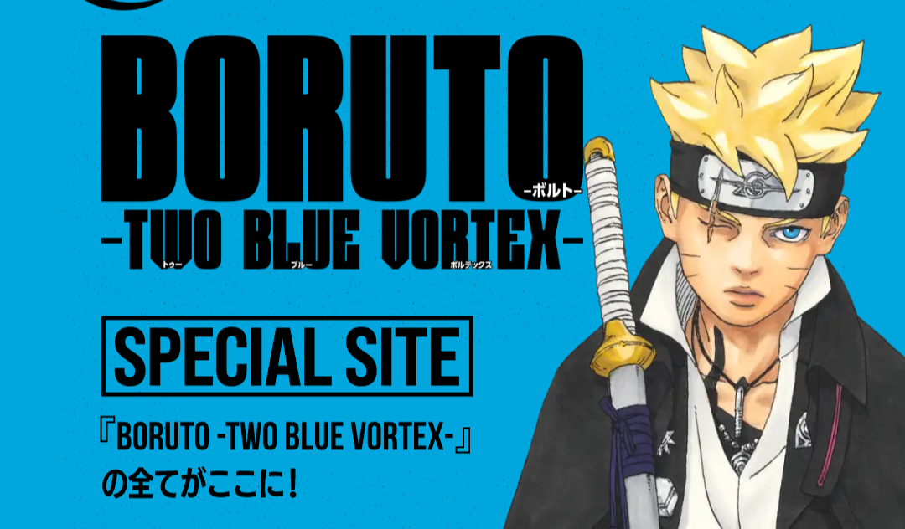
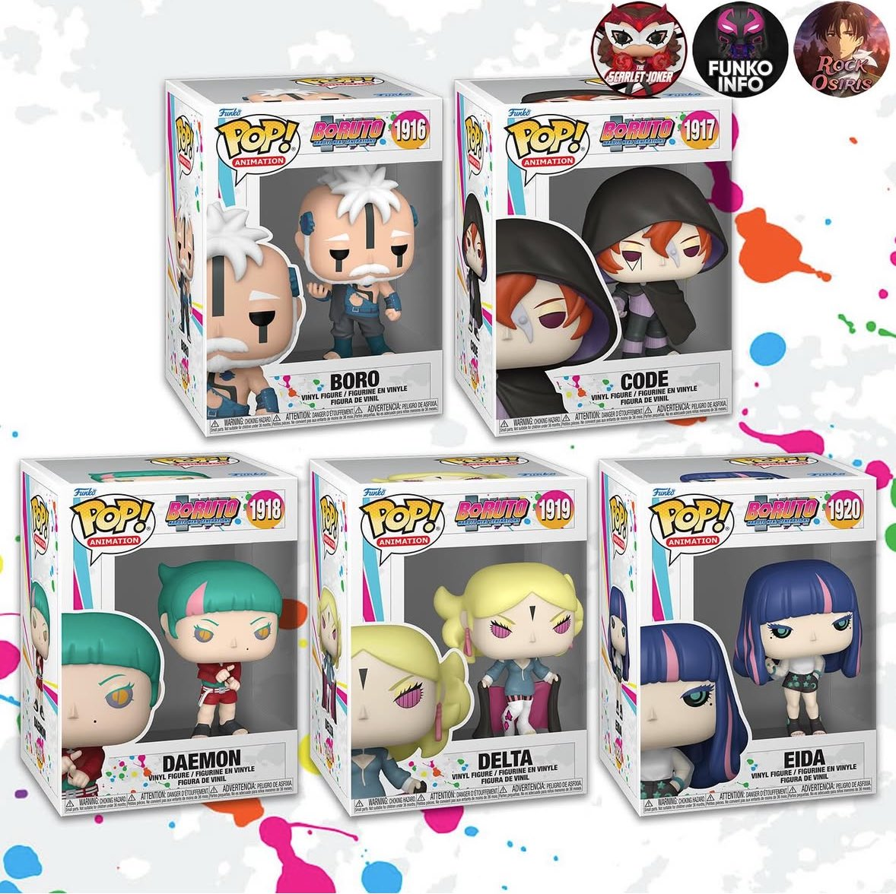
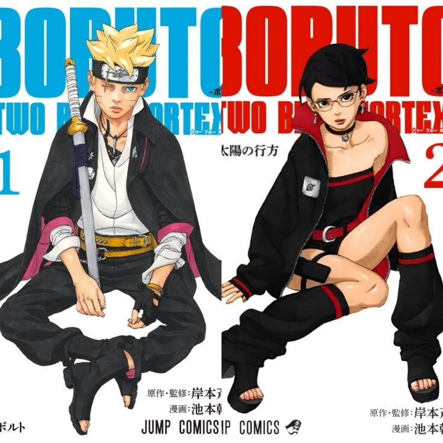

At the end of Boruto: Naruto Next Generation, there were lots of things that lacked in terms of Marketing of the Manga, be it announcements or even official Accounts Posting content related to it, what we always got was coming from anime side which was also created by staff members.

But since Boruto: Two Blue Vortex has started that seems to be change in the marketing strategy for the manga from the publishers, which is really affecting the numbers and how people are finding out about Boruto, even people from Japan are finding out about it now, which was a bit shock for me.

## Sneak peeks

So every month one thing all Boruto fans wait for are the sneak peeks, these are single page sneak peeks shared by the official Accounts, and this has been a lot of help when it comes to people wanting something to get excited about next chapter, they share 2 of these every month and it seems to be working out in favour of the Manga.

## Continued Magazine Features

I've started “reading” Boruto late but this is something I noticed, Boruto TBV time to time gets a feature or a blob related to current arc in weekly shonen jump, which I didn't see much happening for NNG and this works specially for japanese readers as they share about them on social media

## Website

Now many might not know this, but Boruto has it's own corner in the Official Naruto website which works as Boruto’s standalone site, it has all the staff info, info related to Manga and Anime with short summaries. They now also share the Boruto database there.

## Funko Pop

So Funko Pop finally announced the figures for Boruto characters from Code Arc, which was a little surprise but good. Since these are high quality and there is a serious lack of Boruto merchandise, we need more merchandise.

Which also reminds me there was this company that made tshirts from Boruto Panels.

## Hoardings

This is a new way of marketing and yeah NNG didn't get much but time to time people share videos of these video hoardings where they are showing manga edits from TBV. There might have been those for NNG but nothing on level of TBV.

## VJump Covers

Boruto is part of the Vjump manga which also features other big titles as well, including Dragon Ball Super, and time to time Boruto gets to be on the Cover of VJump cover. Which is good for the exposure of manga since people do share those on social media, there are some great poster for Boruto that came because of this.

## Volume Covers

Lastly Volume covers, they are the main attraction for any manga, for Boruto Ikemoto sensei has been going with Minimal Cover designs and it seems to be working really good! Since people are somewhat choosing thes minimal and clean looking volumes rather than the messy looking volumes, it's abit of personal choice but hey…people judge books by their covers.

## Conclusion

I got this post idea just because one day I was thinking that ever since Two Blue Vortex has started the marketing has really been improved.

The Staff are really trying to get readers engaged to manga and also publishers are taking note on what TBV can do if enough attention is given to it.

If this continues then surely more and more readers are gonna give it a chance, which can help Manga because surely NNG had it's own faults but Ikemoto sensei has improved and is trying to fix many things that were not done right in NNG
