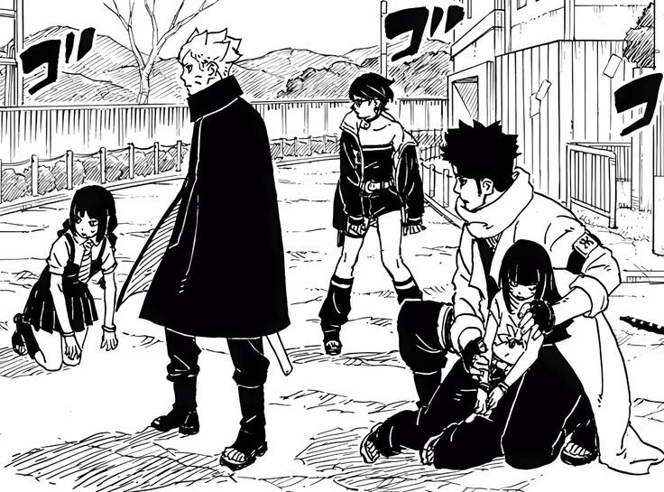

## Introduction

Chapter 11 was left on Boruto’s cool entry in the main Battle of Konoha Shinobi vs Hidari while him saving Himawari and Sarada, now chapter 12 continues from that moment only which is really exciting!

## Following Boruto

Kudos to Konohamaru for understanding the importance of Boruto in that moment, because he could clearly see the power gap between shinjus and themselves! Characters besides main cast im Boruto tend to be dumb and do things they shouldn't be doing!

## Hidari in Battle

Hidari sounded so confident when he was confronting Shinobis but ended up playing really dumb hide and seek game, he literally kept going back to heal and come back then got beaten, until kawaki really obliterated him, like where did that confidence come from? It kinda felt out of his character atleast for me.

## Information is the biggest weapon

From the start of TBV boruto is told be knowledgeable about so many things and one question keeps coming, “How do you know about that”, now there is some information that's shown to be coming from his analysis and some help of Koji, while….there are still some bits that are really weird that how did he know about that, we'll get to that part in next slide!

## True Huzuhiko

I'm still trying to understand the science of uzuhiko, but i somewhat get it in this chapter a bit more..but damn that moment felt like naruto showing rasen-shuriken for the first time in shippuden! A jutsu that can remove existence of someone if given time!

Now best or funny part would be Boruto needs to be connected to ground to get charged but then, what if he stays there for too long! This thing can go as long as earth exists(i might be the last person to understand this) but really, uzuhiko’s true form is crazy hard! Boruto really dumbed it down against Code! And he was not joking when he said he can kill code!

## Sarada

See one thing you shouldn't do is doubting Sarada, in this battle she's caught up really fast! And she's different when paired with Boruto not because she she needed a support but the fact that these enemies are really new for them all, they all are catching up but fighting shinjus can be intimating which we can see from their fight with Boruto.

Now Sarada really held on her own till she could, and even with Boruto in side she really did great job supporting him, Getting Hidari out of Claw mark, hitting him with Chidori stream it says a lot about how she can on base level stand on her own against these Ohtsusuki level Enemies! We can imagine when she activates her MS she can be something else, which is obviously needed for these future battles

## Jura the Sniper

This scene i wanna see animated badly, to get the context of how these tail beast bullets are fired by him and how it's traveling to get to it's point, for reference Delta says they are really far from Boruto and others but still he ended up getting him also he was kinda precise when hittin sarada on hand, Dude shows one new thing after another!

## Thorn Soul Bulb

As i was saying in Information slide, one question directly comes, where did Koji see the thorn bulb, the naming is a bit weird but i think it'll make sense when we get the explanation, there are so many theories out there on what this might be, now one thing was made clear that this thing can get sasuke back. There are many theories out there already and I'm going leaning more towards to the theory that this might be the key to Kawaki getting power up, makes sense since it looks like smaller version of Chakra fruit which i guess it is!
