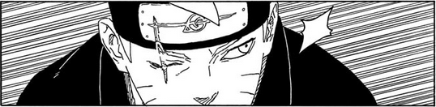

## Introduction

So this chapter felt like one of the OG Kishimoto chapter because of the depth it provides to the story, what i loved about Naruto as a beginner was the fact that it had these crazy concepts that somehow made sense in the story and yeah! This is the chapter to look for in Boruto

## Divine Intervention

Jura is really intelligent because of the way he deals with people around him, and how he analyses situations. Him acknowledging the fact that there are things in movements that's keeping him from killing Boruto is kinda a big deal?

Like how Mamushi coming in with important information right when he was about to take the shot, a second of delay and Boruto would be gone case, but he stopped since they found out boruto has someone with high intel and they are also at the same level of risk for shinjus as Boruto so yeah, Jura’s next goal would be to find Boruto’s collaborator!

## Flashback!!

So yeah!! Finally we got the flashback i was most excited for! And yeah, we got more than what i thought we would be getting! The toads are scientific ninja tools, that's a bummer but well it's fine! I guess it's been some time since Sasuke got treefied and then Koji found him! And it's like Koji did get affected by Omnipotence but he's smart enough to crack down his own memory! Fair enough coming from Jiraiya’s Clone! The flashback makes sense and the chemistry between Boruto and Koji is really somewhat similar to Sasuke-Boruto tho the motivations are different since Koji gave Boruto a clear goal to achieve!

## Prescience

Now this can be it's own separate post but to be honest i feel like people are getting confused between multiple timelines and multiple universes. I have my own understanding tho! Coming to Koji’s ability, it's kinda good that this was given to Koji rather than Boruto so to make him more relevant to the story.

Koji awakening prescience felt like a generic storytelling, yk awakening special ability right on death moment and it felt like they really didn't plan it in NNG but it was for TBV I'm not complaining tho. The ability itself is kinda straightforward but it can kinda clash with the foresight of “momoshiki”? Because definitely Boruto did see those scenes in NNG and also those didn't happen i guess MOMOSHIKI is using the same shinjutsu if we consider that it can be learnt or it is inherited since momoshiki is of high family in Ohtsusuki clan.

## Boruto from future to past

Okay the way Koji was telling everything to Boruto, it seems like he planned everything before meeting Boruto and just explained their plan of action. And it's quite fair use of Koji’s ability to get to know what things boruto will learn in future and then teaching him now, kinda similar to how Kakashi fast forwarded Naruto’e training with Clones.

Tho there is still that tense look from Koji, that it feels like there is still more to this then what he's told Boruto, although he said the darker part of the future but then again Ikemoto wouldn't draw 1 extra panel for no reason!

## To present

Now coming to present time, it's kinda funny how Himawari wakes up, and just goes on to heal Sarada. Naruto had infinite healing ability but he couldn't heal others but well since Himawari’s case is different then yeah good to see she's getting used to the powers.

## Boruto’s Arrest

It's interesting how kawaki now knows that Koji is working with Boruto but didn't say anything about it and just blasted the toad.

Now they've got these sealing cuffs, ig specially for boruto? Since mostly he's the one with crazy jutsus working around, though i wonder if this can hold back Momoshiki or if Himawari goes to heal boruto and she senses Momoshiki? We haven't gotten any hint of him yet besides when karma started grow in that moment.

## Aspects of thorn soul bulbs

Okay! So as somewhat expected, these thorn souls are like seeds, when one shinju dies in battle their thorn soul is left behind, and there are two things that can happen? One that can be used to heal the actual person from which the shinju was made? Ig somehow Koji will get Sasuke back? And also for shinjus, it can bring them back using the divine tree, it's really unique how divine tree and ten tail’s connection is used, because it's also reviving them as well as making more of them using soul thorns.

Which also comes with a possibility of having shinjus in large amount as, we see in last few panels that they used the same method of bringing back Hidari and now bought a new shinju, I don't think it'll be the same one they showed in koji’s memory but who knows it can be the same one which is considered the shinki’s shinju!
