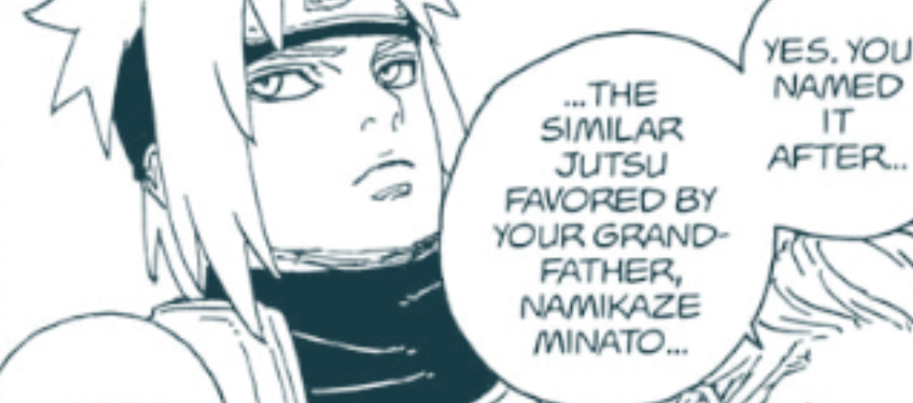
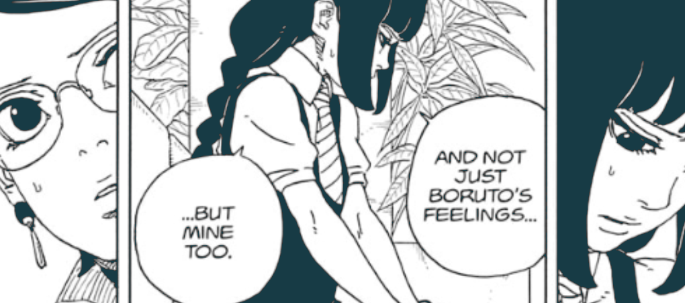
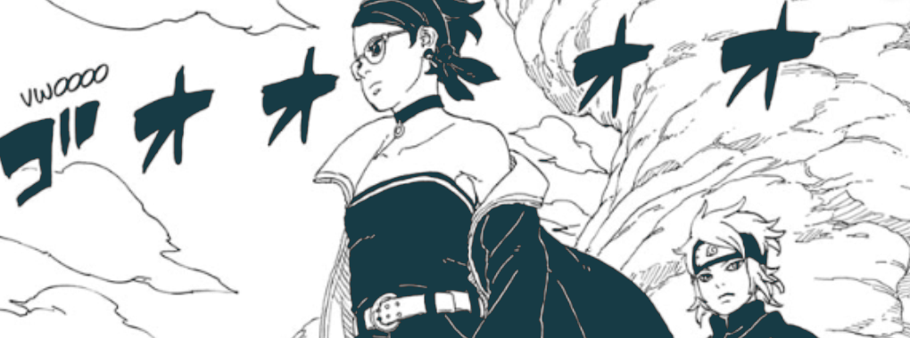

## Intro

Okay! It’s that time of the month again! we got a new chapter of Boruto TBV and yeah again a chapter with lots of things happening and lots of revelations! Ikemoto is using the Timeskip really well to keep up the pacing and also showing different aspects! Let’s get into details of some.

## FRJ - Ohtsusuki Edition!

Chapter starts with a flashback, from the time Boruto was learning “Flying Raijin Jutsu”. This chapter really clears up alot of stuff regarding what this jutsu actually is for Boruto and how it's different from the one Minato created, which was built up on Tobirama. The big difference to notice is the use of teleportation jutsu which comes naturally for Ohtususukis.

So if we go by that, this version of FRJ by Boruto is more dependent on the natural ability to transport through space and time for Ohtusukis. I don't have much understanding of the original one created by Minato, but Boruto’s version is somewhat simpler to understand.

Boruto's Karma allows him to open dimensional portals, a natural Ohtsusuki ability according to Kashin Koji. He developed his own transportation technique by connecting his chakra to metal objects and sensing their location to teleport there, even across dimensions.

To solve the challenge of multiple destinations, Boruto created a system using different shapes. For nearby visible locations, he can teleport directly using kunai or his sword. For distant locations, he uses specific symbols (like the Uzumaki symbol) to better visualize his chakra-embedded destinations.

Rather than learning the original Flying Raijin Jutsu, Boruto cleverly adapted his natural space-time abilities to achieve similar results. His innovative approach even impressed his present self with its ingenuity.

I already have a post written on detailed explanation of this version of Flying Raijin Jutsu, so look forward to that!

## Eida’s Position

Over the total released 15 chapters we didn't get much of Eida or Daemon, they are used to explain to concepts and sometimes getting their reactions but in Chapter 16 we really get to spend time with her. Firstly she gett in between a somewhat awkward conversation of Sarada and Sumire, which was as she said “awkward but enjoyable”.

Best part was Koji from 2 years ago talking to Eida from 2 years in Future, Koji really is a mastermind and he knew at some point Eida will look into past and look into things Boruto was into during time skip. Her conversation with Shikamaru says alot about her standing in Village, she's helping almost anyone who's coming to her. Be it Sarada-Sumire coming to her to learn about Boruto, or be it Shikamaru who comes to her to learn about Shinjus.

Also we get to see that she's somehow working with Koji? I guess after her looking into past Koji might have contacted her and they made some deal? That conversation also made me excited! Shikamaru seems really out of control right now but according to Koji he should follow his heart and do whatever his heart tells him to do rather than thinking about it too much. Now that's really out of Shikamaru’s character but considering how Omnipotence works that's the only way!

Best part about all this is how scared she is from Mamushi, some on Twitter said it wouldn't be surprising if Mamushi doesn't have effect of reflective abilities of Daemon, because one question during NNG was who'd be able stand against the Siblings and her experiencing threats is good to see!

Can't wait for that confrontation, Mamushi vs Daemon and Eida!

## Sumire’s Feelings

Okay, Let’s get to the spicy stuff now! Firstly this segment reminded me of Chapter 69 of NNG!, weird, didn’t make any sense but somehow characters are shown acting on their feelings.

There was always a theory that when Sarada hugged Boruto on their First Meeting, Sumire really did not like that, and now we are seeing the reaction! These are the true feelings of Sumire. Sarada might not really think about it much because she was always there with Boruto since childhood but in Sumire’s eyes that was more then that. It’s the same feeling as your girlfriend hugging her guy bestfriend, for them it might not be anything but there is always a counter thought coming in the boyfriend’s mind.

That might be a really bad example but really at first I also thought this this does not make any sense. But when I thought about it more, this conversation started with Sarada being too much into what Boruto is doing, if you think about it Sumire is right.

There might be a reason Boruto is distancing himself from everyone, so that there are no collateral damages with whatever Boruto is doing.

Well taking up on the opportunity Sumire did talk about her feelings for Boruto, which she regrets after, but as someone said on Reddit, It isn't a Kishimoto story if there are no Love Triangle! Ever since Two Blue Vortex started I have been trusting on Ikemoto and Kishimoto more! And I trust on Ikemoto to not put anything for no reason, We’ll have to see what Sumire does after this conversation

## Shikamaru’s Call

It Feels like now Shikamaru has many situation where he does not have control of, Be it **Shinjus, Boruto-Kawaki, Eida-Koji collab, the elders, and others building opinions about the current situation**. So far he has been keeping up and dealing with things while his mind is playing tricks with him due to Omnipotence.

Koji telling him to act on the feeling of heart, I am guessing Koji did see a future where thing work out in their favour. A future where Shikamaru followed his heart and they dealt with Shinjus properly. And we can see how uncomfortable Shikamaru is right now considering the warning by Elders and the order by Dimyo. He might be replaced by someone as Hokage, He might break some rules just to help Boruto and others Behind the Scene but I guess currently he is the only one who might be able to understand and act up on the feelings and go against Omnipotence.

## Hidden Sand Arc

Okay! As many others I am happy we are finally Out of Konoha Village and seeing the world that we saw properly in Naruto after a long time! Although to me personally this feels repetitive that the second arc of timeskip takes us to Sunagakure. and as always people are assuming someone might die here. That might be the possibility and people are betting on Konohamaru to be the one but well Ikemoto has been surprising with his storytelling, sometimes predictable, sometime unpredictable.

Matsuri and Ryu are there too, which makes sense since Matsuri knows the location where Gaara was sealed, also Ryu’s target is Gaara. Also that location seems to be underground, setting looks quiet similar to when Sakura fought Sasori, We haven’t seen much of anyone fighting in full force except Mitsuki.

Obviously we are getting Team 7 and Sunagakure Shinobis vs Ryu and Matsuri in next chapters, and I really want Boruto to stay away from this because yeah that is the only way we might be able to see how powerful these characters have become!

## Conclusion

Overall I really loved this chapter and as I am reading again and again I am really loving the storytelling where are we are aware of things happening on multiple fronts! In Naruto Next Generation one of the biggest problem was that we did not know where many of the characters are.

Yes it takes for me to read 2,3 times to understand what really is happening and where but I am happy doing that! Fun Times and Looking forward to next Chapter!
