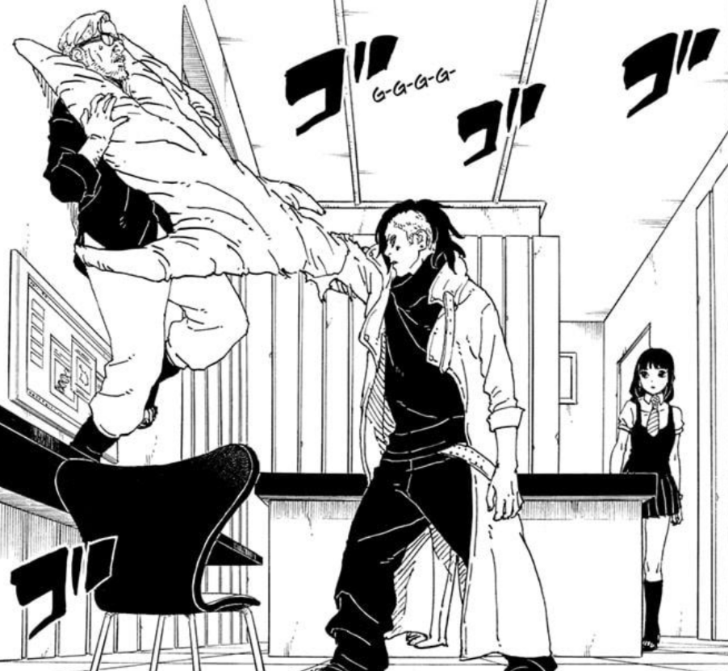
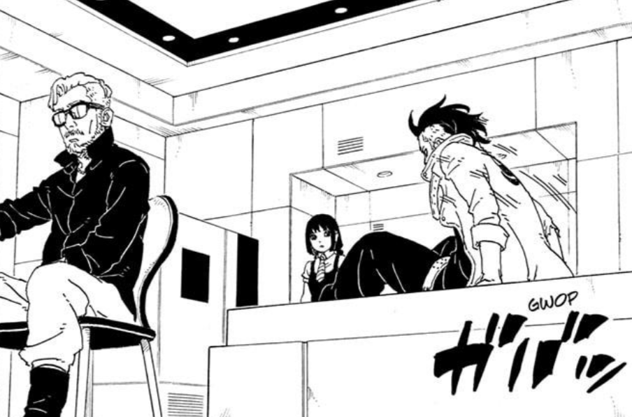
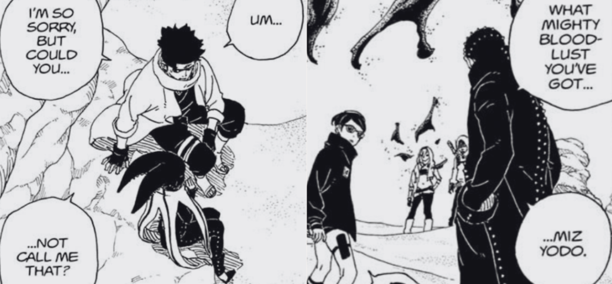
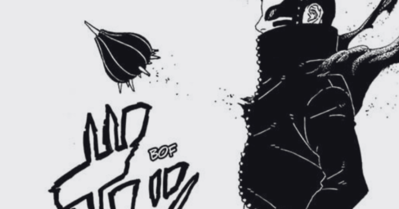
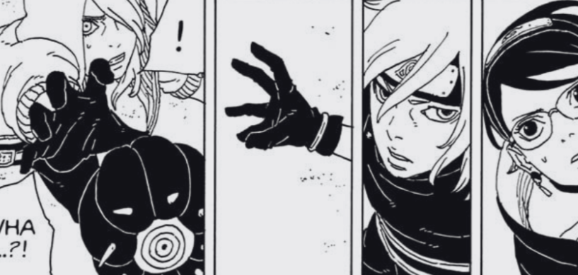

## Introduction

Okay! It's that time of the month! We got a new Boruto Two Blue Vortex Chapter! And for me the chapter a bit slow, I mean it doesn't do too much to overall story but there were some good parts also some frustrating part! I'll talk about some general stuff.

## Kawaki and Amado

Kawaki is really desparate, and looks like Amado is really using that desparation. Amado is using everything to negotiate with Kawaki. At this point does anyone believe Akebi is his Daughter and he's doing all this to bring her back? There should be a catch here no? And I guess we'll know it soon.
But now it feels like Ikemoto is streching the powerup of Kawaki, but I guess we are getting more time with side characters so I'm fine with it.

## Real Shinobi?

This was the frustrating part of Chapter for me, at one side we have Boruto and Koji, who are resolved to do anything for the sake of their mission and don't let their feelings come in way, and then we have YODO and Konohamaru. Even for Konohamaru this doesn't make any sense, Doubt on Shikamaru as some point was okay and fair and then you know how important this mission is and still mess up just because of your feelings? That's just real lack of resolve.

## Ryu and Araya

On side of Sand Shinobis I'm loving how Araya is handling things, where YODO messed up Araya came in clutch. Bro was cool af! I guess we can say that about any Sword User in AniManga. And because of the counter technique made by Shinki and Araya, this match up is going to be so good!

## Soul Thorn Again!

The way RYU just brought out his thorn bulb, for me that's a new info on Thorn Bulb! So far atleast I assumed that for Soul Thorn to come out the Shinju had to be defeated, but here Ryu just brought out his Soul Thorn. So I guess if wanted Shinjus can give up their soul thorn but that means they'll die too.

## Conclusion

Overall it was a basic chapter, nothing good, nothing bad. Or maybe I'm not in the right mindset to be able to read into deep stuff here. For me it was another build up chapter and I know awesome things are coming! So I won't complain much, I'm happy that Side characters are getting their due like a whole chapter without a single panel of Boruto? I'm proud of you Ikemoto! Keep it going!!!

