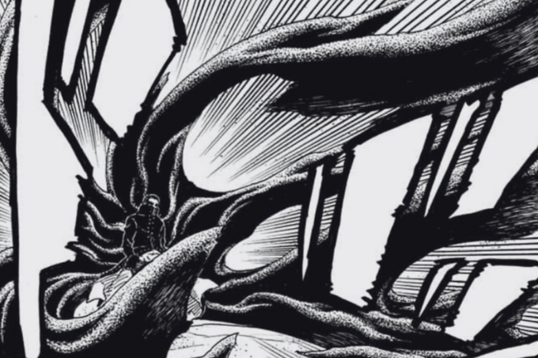

Okay! it’s that time of the month and we got a new Boruto Two Blue Vortex, and overall it was a pretty good chapter, for me the highlight was the art. Somehow art felt more dynamic and moving compared to previous few chapter and also the fact that this chapter includes fights so I guess Ikemoto took the chance and gave us some good paneling.

## Flashback

Ever since Boruto Two Blue Vortex has started one of the aspects I am loving are the flashbacks, which are good and I always compare this to the last 2 arcs of NNG, characters were stuck in 2,3 places, and we only had few characters which was getting irritating. and now we are seeing other character shine.

So this flashback shows us how the sword of YODO created, but also there is conversation that hint at a love triangle, now some might cringe a little but I think this is good because I don't just want to see these characters to mindlessly fight and hate each other, these are the moments that make them a little human and relatable.

## Ryu vs Shinobis

This fight got really exciting, everyone got chance to show their jutsu, and even though Ryu is somewhat still getting used to his existence he was comfortable enough to deal with a bunch of shinobis without any help, dude is confident.

Art in this whole fight was so good! Dynamic panelling and angles, and when Ryu brought out clawgrimes that mess was looking beautiful!!!

## Matsuri and Konohamaru

Bro, I don't know what to say here. Now he's just screaming at her that he's not “comfortable”? What!! As Eida put it in great way…Konohamaru is looking for a bond to be able let her call him something. Which makes sense, but his mission was to trick her not find a bond here! Dude is just out of line here.

## Love according to Jura

In the Shinju realm they are talking about side effects of intelligence, Jura explains how Human's getting intelligence led them to reasoning and comfort that doesn't let them evolve and creates a side effect called LOVE.

So it sounds like he's explains how every living form that gets the feeling of LOVE, makes them divert from their true instinct and makes them do things they shouldn't.

## Conclusion

As I said, overall a good chapter with Jura’s conversation about intelligence and love Ikemoto sensei is building his character to something different and I'm waiting for whatever he makes him do!
