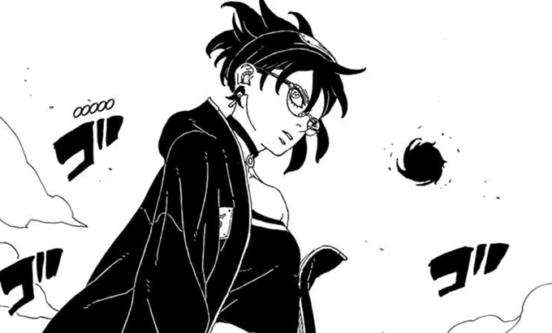
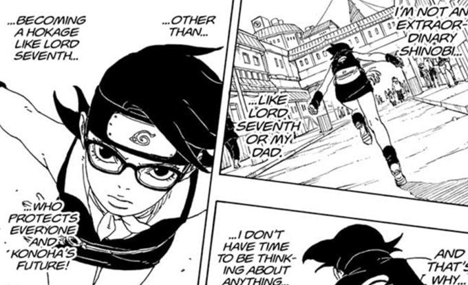
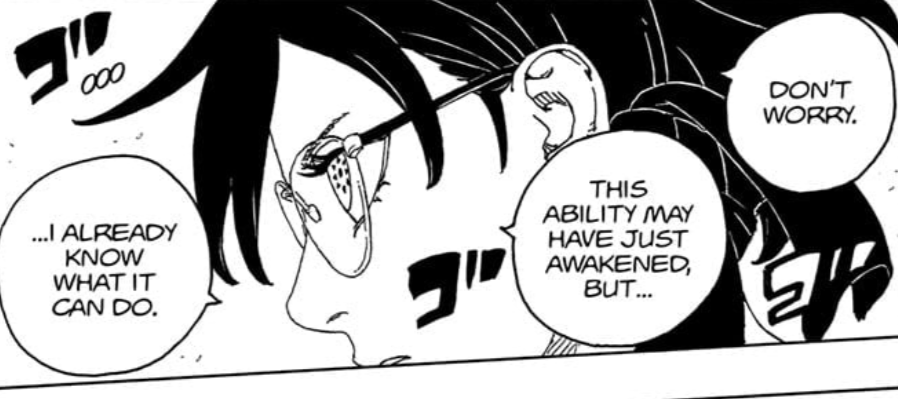
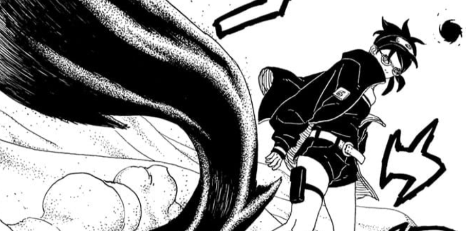
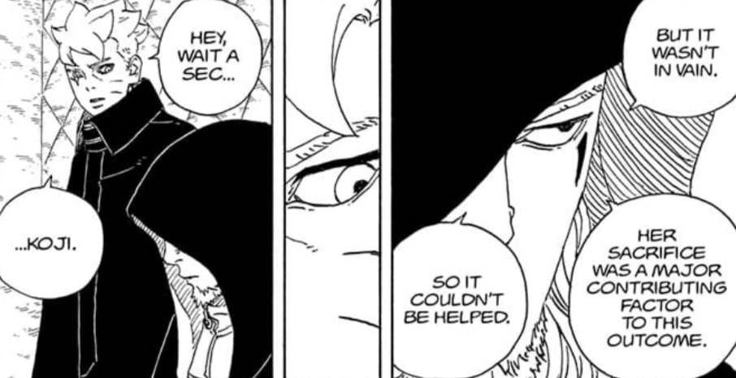
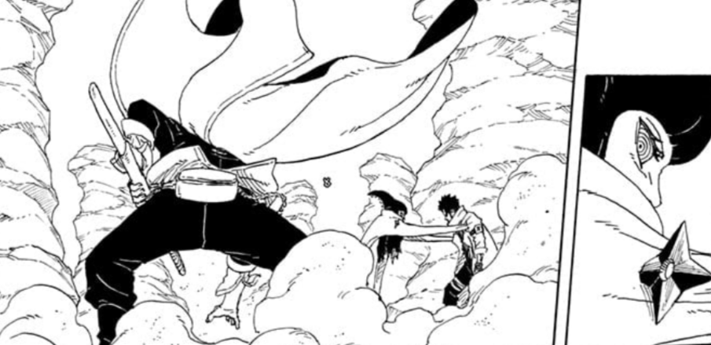

Another month and we get Boruto TBV Chapter 21! Which is one of my most favourite chapter so far! And the star of the Chapter after years of negligence by audience was Sarada! Then we got the first death of TBV!

Overall this was a top tier chapter 10/10 for me!! Although I never give these numbers!

## Sarada's Feelings

I have seen 100 different arguments about how still her having feelings for Boruto is bad for her character, but for me this is the peak of her. Her feelings are shown throughout a long flashback, reminding of her feelings, her goals, as she says she has been ignoring them bottling them as something irrelevant to her goal.
She never shouts about it but works to be someone worthy. Be it her wanting to be a Hokage or maybe acknowledging she has something for Boruto.

All these emotions in the end become her strength, opening her heart and accepting her feelings draws out the capabilities she possessed. that is why showing her feelings was necessary, she isn't Hinata or Sakura, she is more than that cliche. She knows what she has to do and her Mangekyou Sharingan is the outcome of all those emotions.

## Mangekyou Sharingan Ōhirume

A Mangekyou Sharingan is something special in Naruto's World. And Sarada's MS is just a good addition to it. As Sasuke Explains to Boruto, like he is reminding us readers, a Mangekyou Sharingan is not awaken by something painful, but it's the outcome of psychological shock (a mental reaction to a sudden or traumatic event) which for her was Boruto being declared a rouge and a killer.

MS Ōhirume is something that again uses one of Earth's attributes as a reference, the Gravitational force. Sarada seems to be able to pick a point or any object and be able to control gravity in that particular area or on the object. She uses it well against Ryu.

Whenever he tried to attack with his iron sand she uses the gravitational force to dodge it, and then again uses these black orbs to handle gravity more precisely. That's how she crushed Ryu with a load of High Gravity on him.

## Koji's Plan

So from Eida and Koji's conversation it feels like this was all part of his plan, having team 7 go on this mission with the sand shinobi. Having YODO die and then out of desparation Sarada using her Mangekyou Sharingan.

All while Boruto not being involved in it. Because of course then the scenario would have been different. All this so Sarada can awaken and use her MS.

## Boruto's Impulsiveness

That comes to this! If course when Boruto realised this was all a plan from Koji and I was preventable, he jumps the gun and gets into the battlefield, now I don't know if this is something Koji knows already? But his reaction says otherwise, and of course Jura notices him.

Boruto has always been Impulsive during his missions but this is something important and will have big consequences due to his messages up.

## Conclusion

So far 3 Shinjus are down 1 is back again and hopefully other 2 stay that way! I noticed how big players were out of the game so far but now they are in the game again.

Boruto in field again means Jura comes too, I don't see anything else happening so next chapter should be exciting as well!
