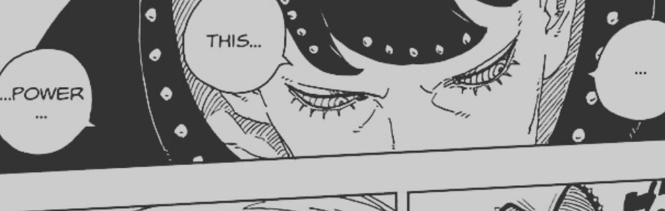

Okay! That time of the month again and we got One of the best Boruto Chapter cover!! Ikemoto sensei changed Boruto's shirt and damn bro is looking top notch!

Overall, I really loved this chapter! Good to see Boruto in battlefield field again! So let's get into details!

## 2 thorn soul bulbs acquired!

Okay now Shinobis got 2 Thorn soul bulbs from which they can get Moegi and Shinki back! I am just curious how this works! Because this is an important detail that'll play big role in future is there are more Shinjus!

At this point it feels like if done properly Shinjus can be handled by a group of shinobis and yup they'll need to power up to handle these trees!

## Jura doesn't care!

From the time he came to existence, It felt like Jura did care a little about his companions, but the way he just completely ignored Ryu and Matsuri's Soul bulbs, it's like now he's just focused on getting rid of Boruto.

It's visible Jura is irritated by Boruto and just wants to get him out of the way but yeah it's a detail I thought was noticable, bro doesn't care about weaklings.

My another guess is he is prioritising getting rid of Boruto and after that he can easily get the Soul Bulbs back because dealing with Konohamaru and Mitsuki is more easy for him obviously.

## Boruto vs Jura

Okay finally this battle kicked off! Honestly, I was hoping they’d drag it a bit more, but nope — we’re right in it. Jura tried to snipe Boruto again, or maybe he wanted Boruto to know he’s there. Either way, Boruto picks it up fast and boom — the fight begins.

Boruto really tried going in hard to get the upper hand, but let’s be real — this wasn’t going to be easy. It’s brute strength vs. speed and technique here, and Jura’s got the range and close combat on lock. Not ideal for Boruto at all. You can actually feel how much he’s struggling to even land a clean hit.

Also, it’s becoming a classic thing now — villains getting annoyed by Boruto’s displacement moves. Whether it was Kinshiki, Ishiki, Momoshiki, or now Jura — none of them can handle that teleport-hax vibe. Sasuke had MS, Boruto's got Flying Raijin — and both just use it so smartly.

Now what got me hyped was Jura actually acknowledging Boruto as a real threat — saying the fight makes “his heart dance in joy”. You just know he's about to go full power now, and I can’t wait to see how Boruto handles that.

## Boruto's Dilemma

Okay Koji talking with Eida, he explained Boruto's situation really well. Now that he has entered the battlefield he can't get out of it without defeating Jura, it a lockdown for him.

Boruto can't easily teleport because he is far away and it'll be hard for him to find his chakra, even if he teleports then leaves Konohamaru and others to jura which obviously won’t end well, so only way is for Boruto to handle this situation on his own! Now somehow koji saying Boruto's done for doesn't feel right it's as if him beating Jura will happen but differently because of the current sequence of events.

Someone on X pointed how everyone expected Mitsuki and Sarada to be hostages but in the end Sasuke's Katana ended up being the hostage which is funny but also shows how much Boruto cares for that Katana because through that only he took on the role his Sensei gave him.

## What is Love?

Jura again and again asks this question, what was funny and weird was for him to ask Boruto and that too in the middle of a battle. For him Love is an emotion that makes Humans weak and that's what led Boruto to him. Even though Boruto knew he can't win against Jura.

To this Boruto does answer well that yes Love is a weakness for Humans but that also separates Humans and the Trees that Shinjus are. A great moment that shows how much deeply Jura is thinking.

## Boruto's quick thinking

Okay seeing how powerful Jura is, Boruto wanted to get him through Uzuhiko, but Jura wasn't letting him stay on the ground, here people are being amazed with what Boruto did but for me it felt normal coming from Boruto. He purposely let himself get caught by Jura so he can stay in one place and build Uzuhiko,

For this again he used the same technique as Code, he bluffed made Jura feel like he was in control but then he got enough to punch jura with Uzuhiko. Now here I feel like this Uzuhiko was not as much powerful since he did it very quickly, building Uzuhiko as fast as possible but it somewhat worked on getting Jura by surprise.

## Nullified Uzuhiko

To be honest, I don't quite understand how he was able to connect principles of Biju bombs to nullify Uzuhiko. What I understand is that Biju Bombs are the concentrated balls of Biju Chakra. And Jura takes it differently, somewhat similar to Momoshiki he compresses the chakra balls further to create a more powerful bullet while maintaining the size to use it accordingly but in that process this Biju Chakra Bullet also spins and I guess this process of Compressing and Spinning the Chakra or Energy is what helped Jura to reverse engineer and nullify Uzuhiko.

It's a streched theory but I'm not sure obviously, I might be completely wrong here.

## Conclusion

This chapter was a solid mix of action, emotion, and character insight — exactly what I’ve been hoping for. Seeing Boruto back in the heat of battle felt like a long-awaited moment, and it didn't disappoint. The clash between Boruto and Jura is finally kicking off, and it already feels intense with both tactical depth and raw power on display. It’s great how Boruto is evolving his strategies mid-fight — especially with Uzuhiko — even if things didn’t go completely his way this time.

I also really liked the philosophical angle that popped up with Jura questioning the concept of love. It's rare to see a villain dive deep like that in the middle of combat, and Boruto's answer hit hard. These moments remind me why I love this series — it’s not just flashy fights, there’s real depth to the characters and their motivations.

Overall, I genuinely enjoyed this chapter, and it’s left me hyped for what’s coming next. The pacing, the build-up, and the tension are all working really well right now. I just hope we get to see more of how Boruto plans to turn this around — because if there's one thing we've learned, it's that he never gives up easily.
