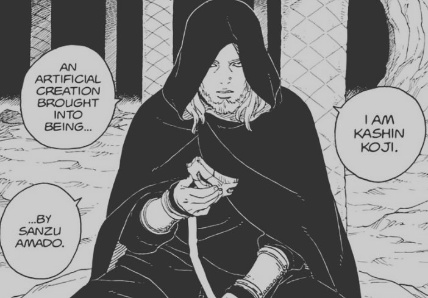
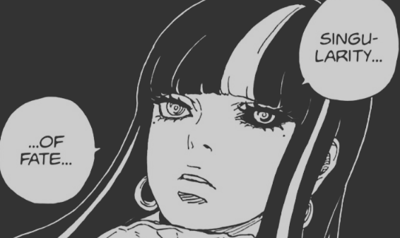

> Just a little note, The things I try to explain here are what I understood after looking into things and come from whatever the little knowledge I got, so I can be completely wrong or the meaning of Singularity can be changed at some point in later story.

In chapter 16 of TBV Kashin Koji Introduced the concept of “Singularity” according to Koji a singularity is someone who knows both good and bad future, by knowing them, this individual tries to push the current situation into a way that leads to a good future.

It's been clear that there are multiple branches created for the future based on your action, you perform one action and according to the reactions there can be 2,3 results of the action where different futures are created. Some might be good and some some might be bad.

Most of us try to predict our future based on the decisions we take, and we hope that we will get the good future. Boruto asks the same question, If kashin Koji can see both good and bad future then why not just share it with everyone so that they eventually get to the good future and avoid bad future.

To this Koji explains that the more people know the more the future will change from what it eventually was, and that means it's not possible to predict what was initially gonna happen.

For example, We all get our personalities based on the life experiences we get, there are good experiences and bad experiences. Now it's possible that even from a bad experience we might get something good in future, but if there was a possibility that we knew that there might be something bad happening to us, we might act differently and that would change the future where we might be getting a good part of it.

At the end the thing is, according to our human nature if we know something is going to happen there is a possibility that we might act different and that would change the future for which we acted certain way. In koji’s words **_“TO KNOW THE FUTURE IS TO DESTROY IT”_**

From all this comes “Singularities”, Individuals who know the future, good and bad both and through certain actions they push little by little to a good future. They work in shadows and influence people around them to act in certain way so that eventually the bad future can be avoided.

Personally I'm loving this Idea since it makes the Character of Kashin Koji and Boruto really in-depth and cool! It's really redefining the concept of Shadow Hokage who is already working behind the scenes but now with more responsibilities.
