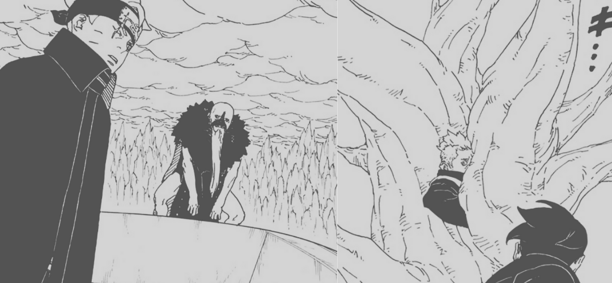
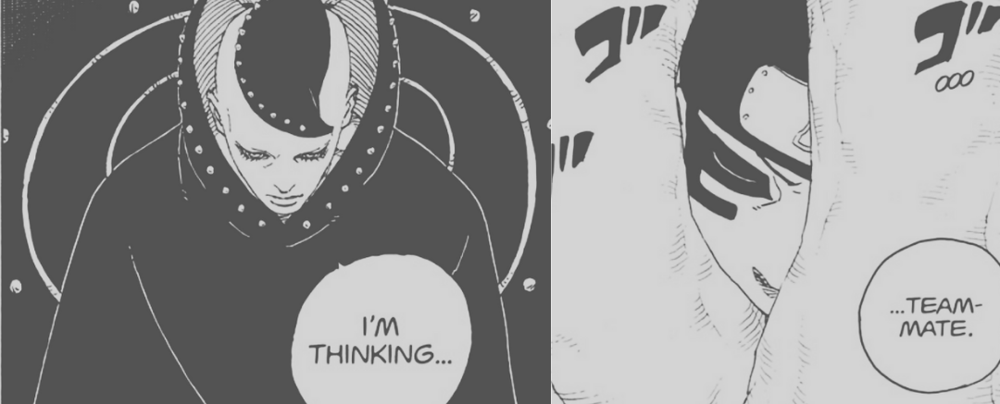

How Shijus are made is a bit of mystery till now, it's hard to explain but just think about it. The amount of people devoured by Clawgrimes and the amount of Shinjus created has a big difference.

And I guess we got somewhat of an answer about that, although it has some loop holes here and there but let's talk about it!

## Shinju Intro

When the concept of Ten Tails getting conscious and then being made into it's own entity came to be we got "Shinjus", that's the basics of it.

Now the thing with these Shijus is that they are made from a blueprint of someone's chakra. someone who was eaten by the Clawgrimes, who are the being creating by Code by compressing and enhancing parts of Ten Tails.That sounds abit weird but yeah that's how Clawgrimes were made. Coming to the Shinjus, one thing from start was not clear that's if Shinjus are created from the people eaten by clawgrimes then why are there only 4 of them? Because when Code attacked Konoha they clearly ate lot of Shinobis fighting them, but we only got 4.

## Randomizer

Initially I thought they were created from the Shinobis who are highly skilled basically higher than any regular Shinobi and that's why we see HIDARI who is based on Sasuke and also Matsuri who is based on MOEGI.

But then comes the Issue, we have Mamushi who is based on BUG. This doesn't make any sense since Bug is not powerfull to be considered being a Shinju. For him I concluded that since he was present when Shinjus were created and he was one of the first to be devoured that could mean he was randomly picked.

One of the purpose Shinjus are carrying the urge of getting Knowledge. They are evolving and learning stuff, and that makes up for my next theory, the main point of this post.

Shinjus evolving through Knowledge and Experience has lots of implications, which comes with my theory is that now they are able to choose on who to make a Shinju.

In Chapter 15 we see Matsuri talking about how Shinki is really powerful and believes in teamwork. And how he could be a good teammate. After which we see Matsuri using a Soul Thorn from which we see a new Shinju getting created

We are not told the exact process of what's happening, but the base of all this is a Thorn Soul Bulb, which looks like a seed. Something that divine tree connects to and comes a Shinju.

All this means that in future, Shinjus can choose from who's Chakra they want to make their new gang member but also the amount of their gang members.

## Ten Directions

Koji through his Ten Directions ability saw that there were "Lots" of Shinjus in Future and I guess since the existing ones have all the Chakra prints they can jist mass harvest them which would ne helpful if there comes a War!

Not all of them might come with crazy abilities, but we've seen how the abilities are enhanced from their old self, which to look forward to.
