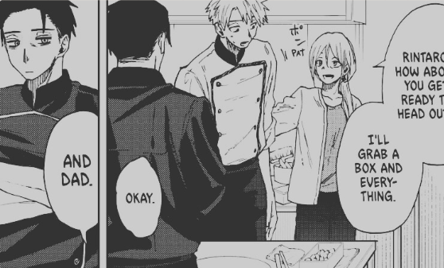
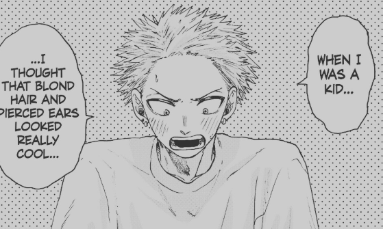
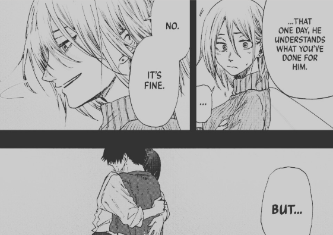
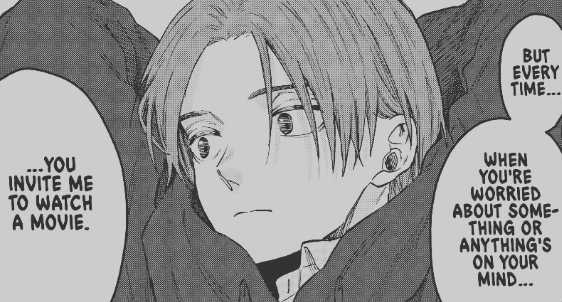
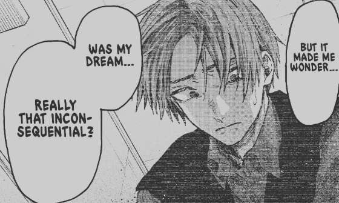

import Manga1 from 'assets/06.png'
import Manga2 from 'assets/07.png'

As The Fragrant Flower Blooms with Dignity anime is ongoing, I wanted to talk about a bond that I loved so much and personally related to in this story. There are some light spoilers for anime-only viewers; nothing major; but I’ll be focusing on a certain character who I absolutely love.

And that’s your gentle spoiler warning.

One thing I really enjoy in any romance manga is when the family is involved. In TFFBD, Rintaro’s family plays a key role in bringing him and Kaoruko together, especially since they meet in his family’s cake shop. At first, I thought introducing his mother would be it. Then we saw his father, which already made me happy. But when they introduced Rintaro’s older brother Sotaro, things got even more interesting.

Rintaro’s character is shaped heavily by his childhood. Because of his looks and body build, he was often left out of groups at school, which made him self-conscious and socially withdrawn as he grew up. But when Kaoruko entered his life, things began to change; he opened up, became more comfortable with others, and started expressing his inner thoughts.

We also get perspectives from his family. His mother wanted to help him through that difficult phase but didn’t want to dictate how he should live his life. Sotaro, his older brother, felt the same dilemma before leaving to chase his own dreams.

As an older brother myself, I related to this so much. The best feeling is seeing your little brother grow up before your eyes. Ideally, you become partners in crime; understanding each other, correcting each other, and guiding each other in the right direction. But part of that bond also means watching them go through different phases of life where you can’t really intervene, even though it hurts to stand by and do nothing.

Sotaro experiences exactly this. He sees Rintaro shutting himself off socially and desperately wants to help. He tries to play with him, gives him things to read or watch, and even shares moments like watching a horror movie together; creating a space for them to talk, bond, and maybe ease Rintaro’s loneliness. Later, Rintaro realizes that this was Sotaro’s way of being there for him, even if it wasn’t obvious at the time.

This is the part I related to most. When you see your brother down, you just want to help. And sometimes the best thing to do isn’t advice or solutions, but simply keeping them company; engaging them, distracting them, and making sure they don’t feel the weight of their problems alone. That’s what we do naturally, right? As older brothers, we want to keep them safe from as much pain as possible.

All Sotaro wanted as a kid was to make sure his little brother was happy and smiling. And that’s why one moment hit especially hard: when Sotaro saw Rintaro changing back to his black hair, he realized something had shifted. He felt relieved, because he knew Rintaro was finally changing, moving forward. That relief even gave Sotaro more focus on pursuing his passion as a beautician.

One of my favorite panels in this whole Sotaro arc reflects this feeling perfectly, because I’ve had almost the exact same moment with my own brother.

  
  

Parents having time with their kids is always special, but sibling moments like these are something that stay with you for life. And this story captures that bond beautifully.
