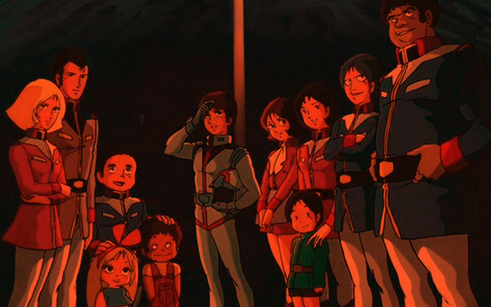
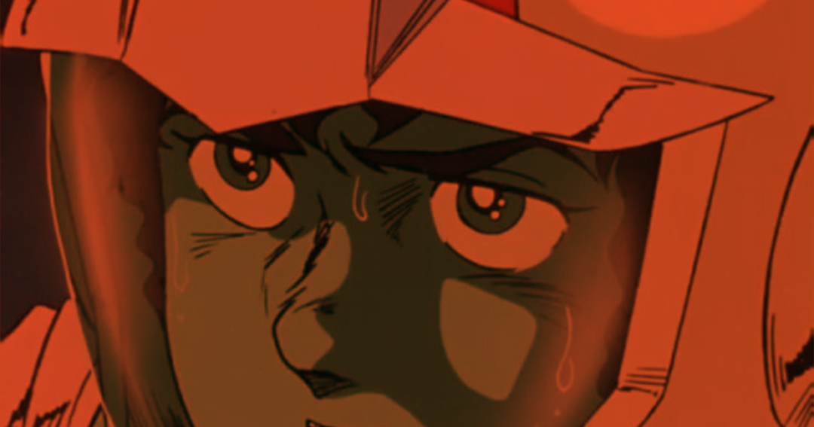
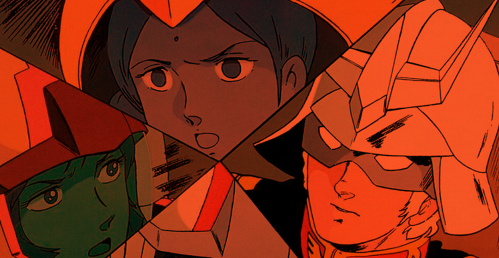
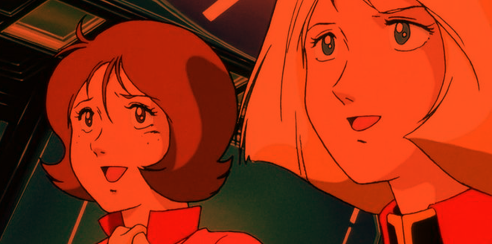
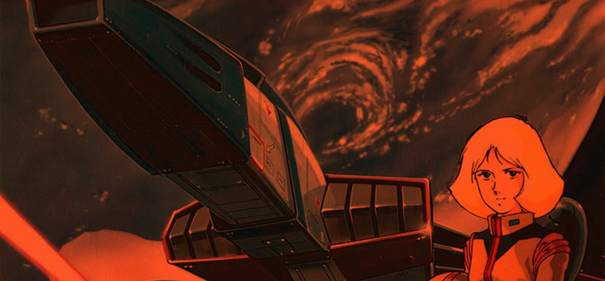
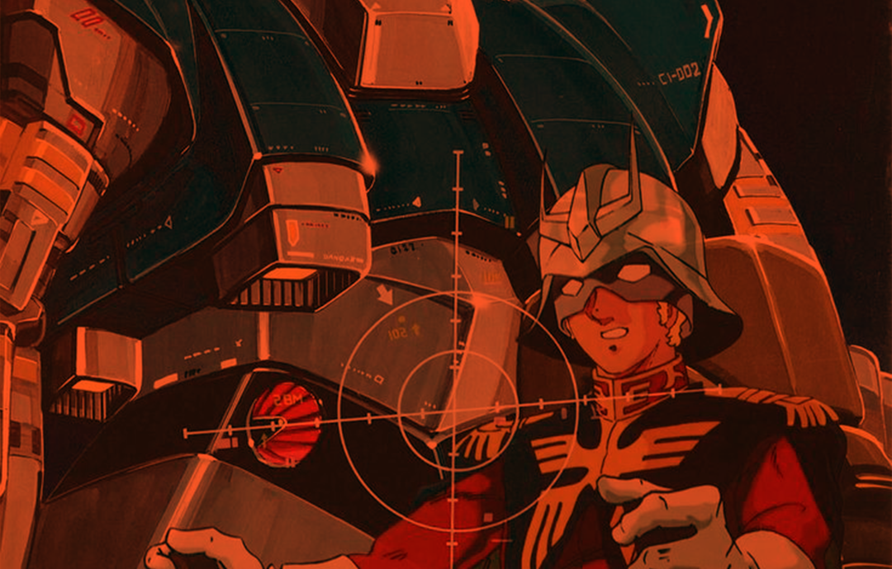
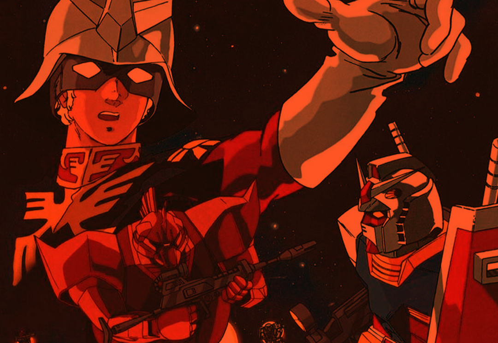
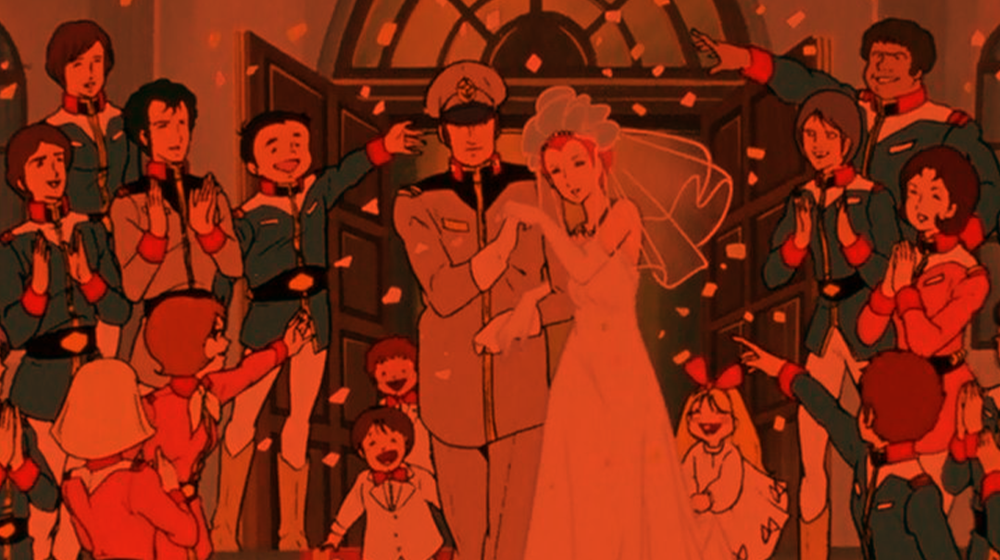
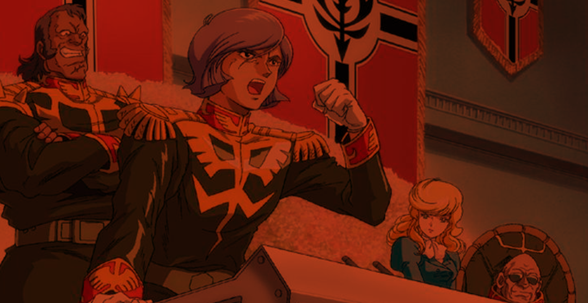

## Introduction

Firstly, i am not that capable of reviewing or say things regarding this classic, but also i wanted to share few of my thoughts i had while watching this series, also since I'm watching the gundam for the first time (the main timeline) i wanted to log it in my account so that helps as well!

## Storyline

I already got the gist of how messy Gundam franchise is to get into, but after reading through some reddit posts and watching some YT videos i got the idea of where to start since Gundam story is spread out in multiple timelines and maybe multiple universes? Here i am focusing on the main timeline which is called Universal Century (UC) timeline. After that i might get into AU which is alternate Universe, as you can guess this is a holy mess but a fun one, and in this post I'm covering the original MOBILE SUITE GUNDAM (1979).

Coming to the show! I really love it!! It's been a while since i got into a classic and that too this old, there were moments where i got bored and confused but most of the time i was really just going into it one ep after another.

The story revolves around 2 fronts, The earth federation and Principality of Zeon. Overall show focuses on the crew of “white base” who are this makeshift young bunch of people. Most of them got into this out of circumstances and then just became part of the earth federation army as White Base kind of became the main target of the Zeon front since White base had some technically advanced mobile suites which were pain in the butt for Zeon.

Over the time in show we see how they all get close and care about each other, also what's great about the story is some of them died too which makes sense since it's a war story.

For the white base crew, you can see their growth in all 43 episodes, we are shown all them having some kind of conflict in their life, but still they go beyond all that to serve a purpose to save the people they love. Even the 3 kids onboard white base kind of had their moment which solidified their place on the white base.

## Some weird tidbits

Problem with me watching this show is that time to time i forgot this show was produced in 1979. I love this old pastel art style and you can notice how old this show is by that fact that when some frames are moving there are dust particles that came with scanning, it's really visible on the screen and it's fascinating.

Thing is this particular story in the whole gundam lore although main story but starts from the middle of the war where we are given recap of war at the start of every episode. With this there are some issues regarding how the story is set overall, maybe it's the way they used to do the storytelling during that time, but for me it was weird.

So like there will be a sudden romantic build up that you'll not even see until last moment, and that only lasts moments, people are angry but no context why, some things that characters do, doesn't make sense, although over the time you can see how they evolve but also these weird stroy points keep coming.

There will be upgrades to gundam but we'd not know how they got it until in some random scene they'll word it out. It seemed weird gundam having a new weapon out of nowhere! Also the thing about Amuro, like he's never shown to be training i mean after half season is over we get glimpses of him figuring out but till then he somehow knew how Gundam worked which was well weird to me, now i might be completely wrong about it all but these are my observations.

The inconsistencies took me off-guard, it has nothing to do with production quality but general storytelling maybe because show kinda starts in the middle of main story but also there are things happening behind the scenes that affect the story but we are not told. It's stuff like that, which were kinda turn off but yeah these are the things i was noticing in almost every other episode, tho when the finale was coming, the writing got really really good!!

## War story

In terms of showing war in the show, Gundam nail it on point! I mean it's a show based around war and that's why showing battles with human emotions is not really easy and also the fact that there are so many characters to handle, which gundam does really well. Although the main focus would be on Amuro and Gundam, other character are given chance to shine, they get frustrated, angry, emotional, they get greedy!

Every character has their own story and a thing to deal with while battling with enemy, which was the most interesting aspect of the show for me!

## Artstyle

I'm a big fan of this pastel artstyle from Old school animes and also these computer effects from back in the days that Gundam has used quite well! Although that's also the part that held back the show but during big battles the art style really shines because of the big explosions, they are trippy but artistic! There are few scenes that'll make you think, if the animators were high while making those scenes! XD

## Soundtracks

Soundtracks are an important part movies and shows, Mobile Suit Gundam also has some really good soundtracks that are stuck in my head, but again it has that issue of inconsistency. Inconsistency in terms of how the soundtracks are, sometimes though come abruptly, and that confused me big time on certain moments, also when you think about it, a soundtrack is connected with a particular vibe of a scene, some soundtracks are for villains and some for heros, but im Gundam even a mid character will have a soundtrack that played for Amuro just 2 eps ago!

## Conclusion

I must say, showing robots fight and then showing meaning behind it is now easy, that's what they nailed coming close to the season finale, final battle was massive in terms of scale and they showed it really good. At times it felt like this is what star Wars should have evolved to. For me Gundam showed the possibilities of what can be done with Space war setting and that too handling sci-fi this good with the production quality of those times, it makes sense why this is a classic that's loved by everyone. And sadly not much recognized!
