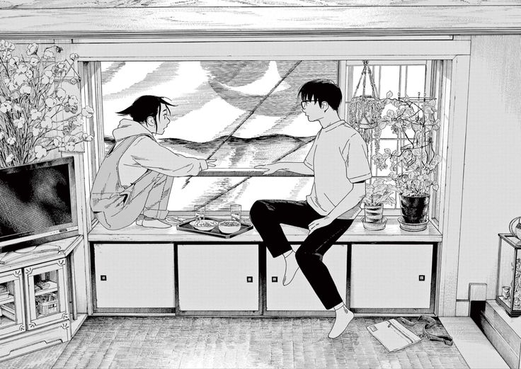
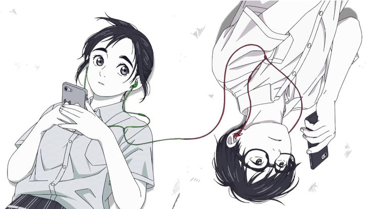
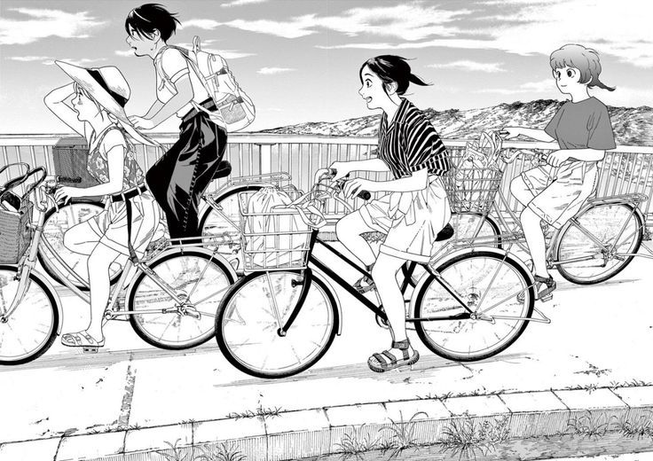
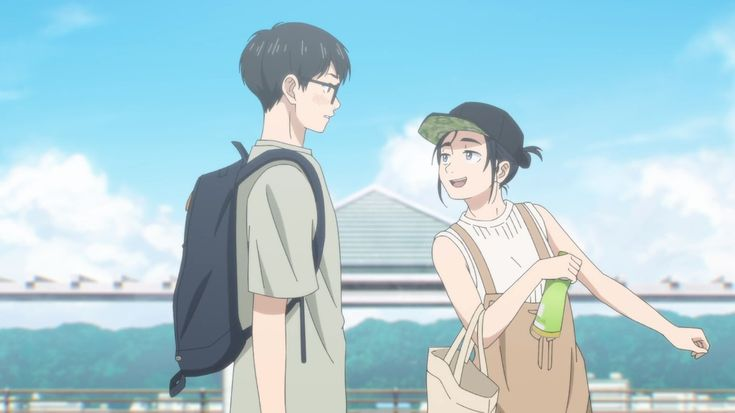

## Story

The story starts with Nakami and Magari, two high school students suffering with insomnia ( a situation where people can't sleep properly but are sleepy all day).

After finding out, together they can help each other with their common problem they join a photography club which does not have a supervisor, making their sleeping in day possible

Then story moves to how their love for each other and passion for photography grows together, and slowly connecting to people around them.

## My connect

I left so many plot points there, because i wan you to explore the series.

I could connect to the series so much because i was having the insomnia issue too, there were many aspect of a insomniac that author covered really well.

Then also the part pf Photography and getting along with people around you, i have a passion for photography too, since my father is a photographer, since childhood I'm seeing him clicking all these great photos i wish I'll click someday too.

## Art Style

Art Style of the series is really beautiful, at times some panels are mesmerizing.

Mangaka Makoto Ojiro does really great job showing some intense emotions, and during the climax where things get really emotional art does great job showing how characters are feeling.

## Anime

Luckily there is already an anime adaption of “Insomniacs after school” with 1 Season and hopefully they'll adapt the whole series since the story is complete now.

In anime too, the art style is really good and compliments the Manga art style.

