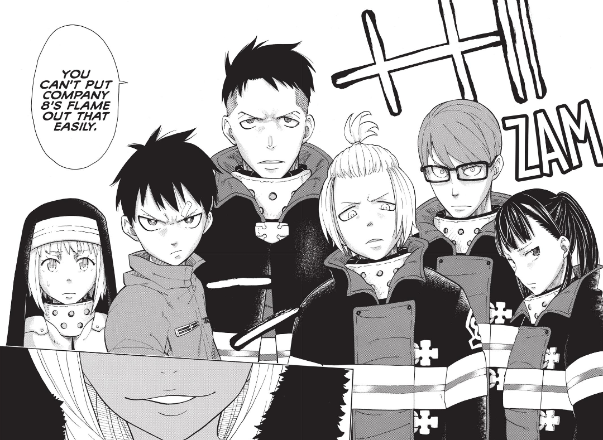
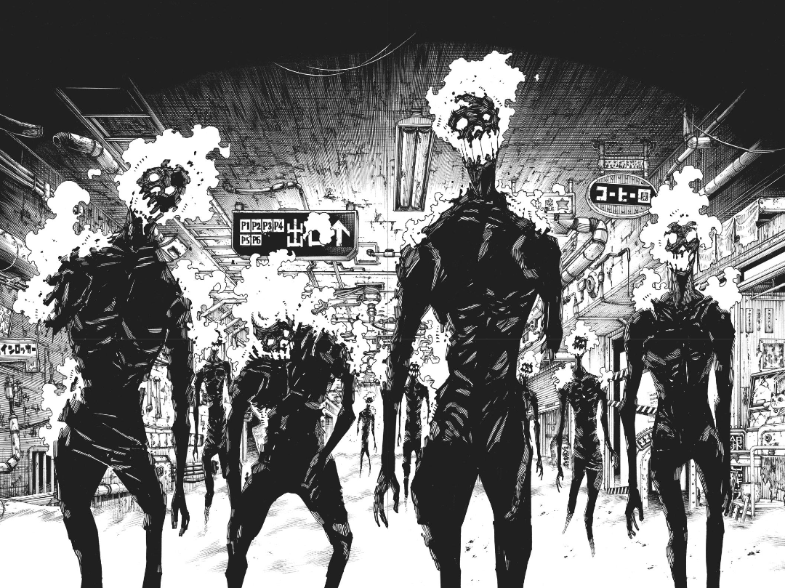
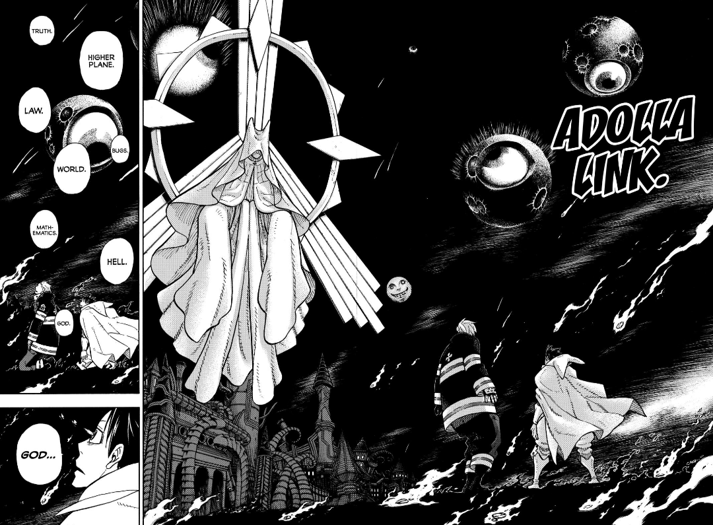

import Manga1 from 'assets/manga-1.png'
import Manga2 from 'assets/manga-2.png'
import Manga3 from 'assets/manga-3.png'
import Manga4 from 'assets/04.png'

I was finally able to finish this 305 chapter journey, as always I started reading it fast but then got burnt out I had to leave it for sometime and then it was slow burn!! It was unbearable but i finished it!

To say in a few words, it was good at start but when the end started coming it was just talking and talking!! I mean the climax is just full of so many new and random concepts started coming I couldn't focus on what matters the most!

Fire force started really really amazing! The fight choreography and world building with these characters were fun, Shinra did feel like a typical shonen character who goes around screaming "I WILL BECOME THE KING OF PIRATES!!" or "I WILL BECOME A HOKAGE!!", but here it was not in the face that much.

Side characters were handled really really well! Benimaru of course is my favourite one! His fight with his doppelganger finished fast I wanted more!!

My biggest complaint with the Fire force is how there are so many random moments! The biggest one being Tamaki (personal opinion, but if she wasn't in the story I don't think it would have affected the story), she had whole chapters dedicated to showing how her eroness matters!! Like fr? Whenever she came the story felt stalled, I mean yes you can have fan service with her but she's nothing more than that, those chapters could have been given to other characters and it would have made more sense.

  
  
  

One thing Ohkubo Sensei did so well was how much he was creative with Fire Force, like suddenly a character comes to reality and this character is an actual person not a character! those few pages made me shocked and excited! Like that's some level of creativity! And I want it more!

Mangaka did that a few more times! Adding pictures of real life locations, I mean many mangaka do that but here it was good to see.

Oh and yes! Shinra and Shō's brotherly bond was a pleasure to see, being an older brother I could relate to many story points mangaka touched upon, but yeah the way shō got around her brother really felt half assed like seriously? He connected a few dots and he was like, "damn it all, I'll just leave the group I was with for years and go to my brother I met just a few days ago!" At the start he was not believing what Shinra said but suddenly was not trusting his allies? I mean okay? But for me Shinra and Shō working together were more than any of my complaints ( and why would you show their mother like that? She was beautiful!! But then showing her as devil? I mean come on, you could have made her look like she used to be and then just say that's how Shinra remembered her)

  

Oh and Arthur, I feel like Ohkubo Sensei at some point didn't know what to do
with him, I mean okay Arthur's power is connected to his imagination but like
for the whole climax he was just looking from outer space and doing nothing, and
somehow Shinra could hear him...okay?!?

Shinra's final transformation looked supperrr cool! It was FAMILY WITH POWER OF LOVE!!!

Coming to the ending. I mean again a mixed feeling with the ending, it was satisfying on one aspect but then on the other part it felt like Mangaka could have done something different and it could have made sense! Well If he wasn't forced to finish the manga and this is the ending he wanted then I'm happy for him!

All in all, Fire Force really is a new gen Manga and in a really good way! I'm happy I was able to experience it!!
