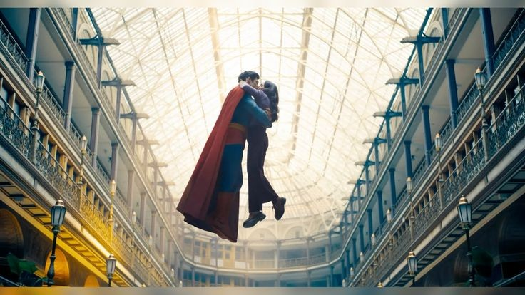
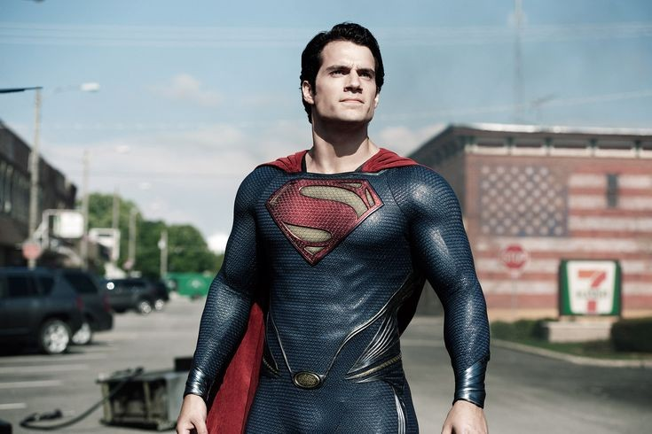
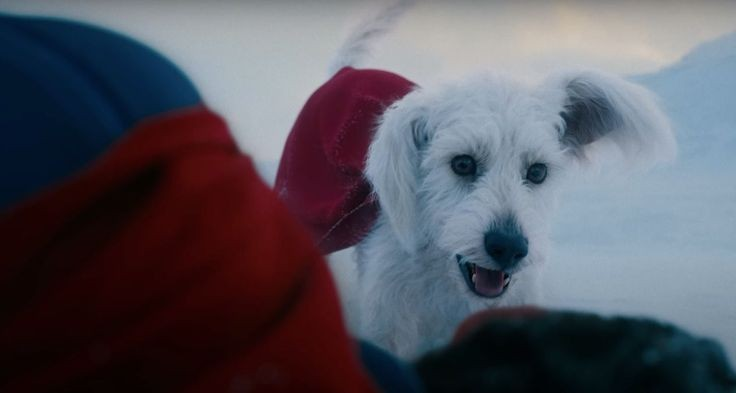

We got a new superman in a newly formed _DC Universe_ and someone who has been following Marvel and Specially **James Gunn**, I had some thoughts on this kind of a Divided Narrative that's going on just from a Teaser when the movie is coming in July. Which is important to note because Movie go through alot of changes even when there are weeks left that too when there are productions with tight schedules which is becoming really common nowadays.

## Overall Look

If you look at what James Gunn has shown on Cosmic level in Guardians of the Galaxy Vol.1, Vol.2 and parts of Vol.3 it's really Colourful, but from what I have noticed since his Suicide-Squad there is a tonal change in his preferred look specially for grounded scenarios, like when there are shots of Earth in GOG or Suicide-Squad. These shots are to say very flat in terms of colours like the meter for contrast is low and there is less saturation (I don't know if it makes sense, because in my mind I am clear in my understanding but it's hard to explain in words).&#x20;

Another change in his preferred cinematography I noticed was used of very wide shots which are also changing which gives a weird feeling when looking but somehow look good? Like best example of this is the final one shot fight from Guardians to the Galaxy Vol.3, the depth(idk if that's the right word) keeps changing and shot keeps changing from Wide angle to normal, which I must say looked weird for me at first but slowly I got used to it and that's what James Gunn carried in the Superman, I guess he wants to make it his staples.

## The Comparison

From the day this movie was announced one constant comparison was Zack Snyder’s Superman played by Henry Cavill. Obviously that happens, when a new Actor plays an Iconic characters he/she is compared to their previous actors, but problem this time is how toxic this comparison has become.

I am looking at a different perspective here, personally I am happy that we are even getting anything DC related and the path they are going now since past few years for DC Movies have been really bad. And I trust James Gunn, whatever he did in MCU on Cosmic Level on screen or off screen is Magical and those who have been following him will surely understand it.&#x20;

And that's why for me this comparison is really just outright dumb. Snyder tried his best it didn't work out whatever the case but you can't just get attached to something that's clearly not coming back, it's just gonna hurt more. You move on and accept whatever is given to you, and in this the ones complaining are not gonna get anything whatever they try, so why not just give it a try with open mind?

Okay coming back to comparison, one of my favourite Pop culture Youtuber said something really good, Zack Snyder tried making Superman a GOD, with all little notions to him being someone closer to a God who saves people and people consider a messiah. In comics Superman is a different character, he's an alien who's trying to fit in with Humans, someone with super strength who doesn't consider humans below him but considers himself as one of them and protects them. Whatever Zack Snyder did might have looked good on screen but that wasn't Superman which was envisioned by its creator. As for James Gunn, he already showed his intent during announcement that this Superman is closer to what he is in Comics.

I watched teaser few times, and one thing I might say, although the shots look flat the CGI is still blended so well, which is the fruit of the Storyboards created by James Gunn, he used to share the Storyboards on Instagram and one time he showed this big bunch of paper which according to him were shot by shot Storyboards of everything that was in the Movie, and after all the years of me following VFX artists one thing I understood is the difference these Storyboards make for CGI of the movie and that's why I am sure the CGI will look good, and I mean in any James Gunn Movie the visuals are never the shortcomings.

Overall, I just wanted to express how visually Zack Snyder created the Men of steal or any other Superman depiction on screen it's time to move on from that and accept this beautiful depiction James Gunn is gonna present, because it's not as bad as what on social media is shown. The Teaser starts with Superman injured badly and that shows how vulnerable this Superman will be which is what I wanna see. A superhero not an alien trying to be god.

### Teaser

<iframe
  width="660"
  height="360"
  src="https://www.youtube.com/embed/uhUht6vAsMY"
  frameborder="0"
  allow="accelerometer; autoplay; encrypted-media; gyroscope; picture-in-picture"
  allowfullscreen
  className="my-6 w-full"
/>
