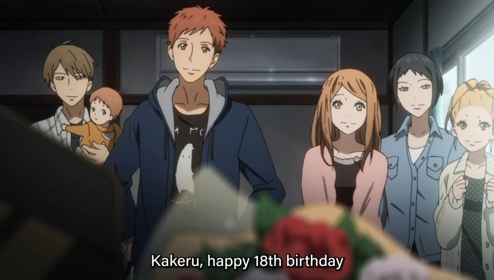
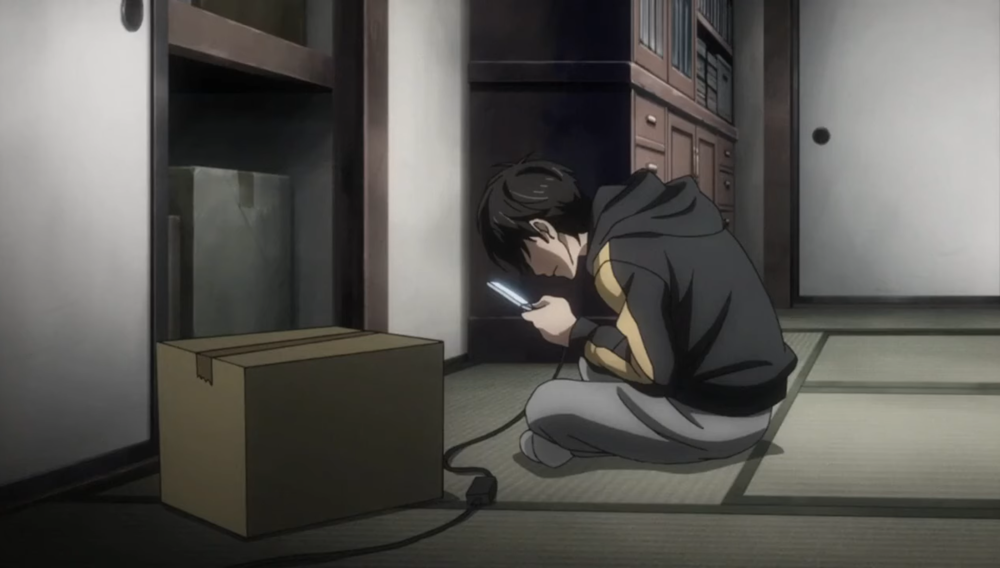
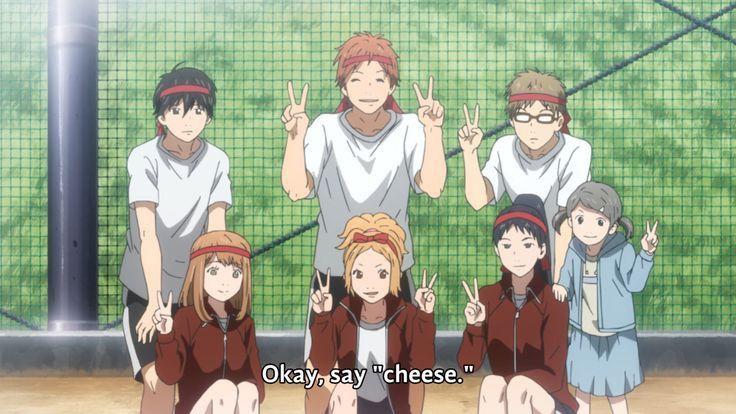
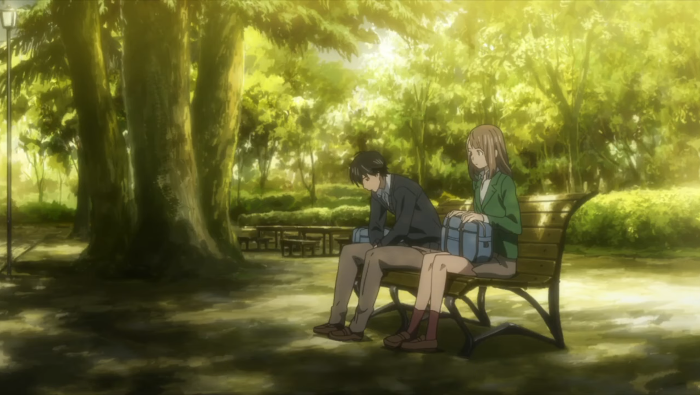
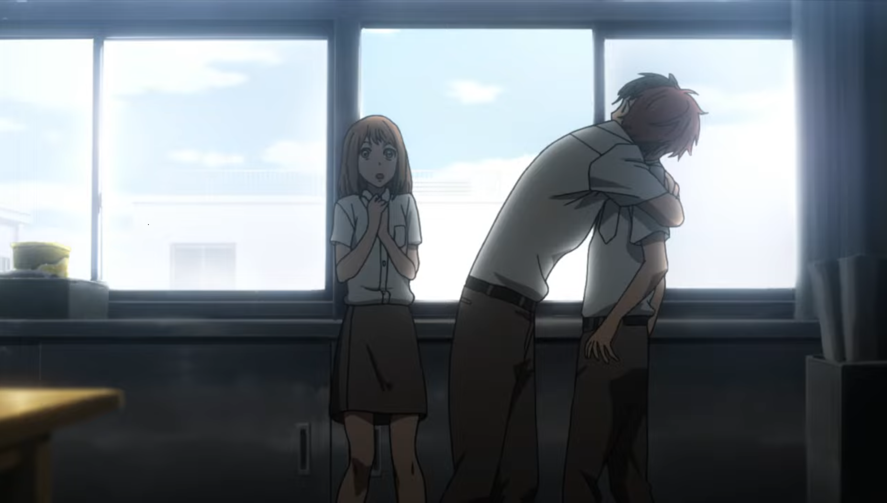
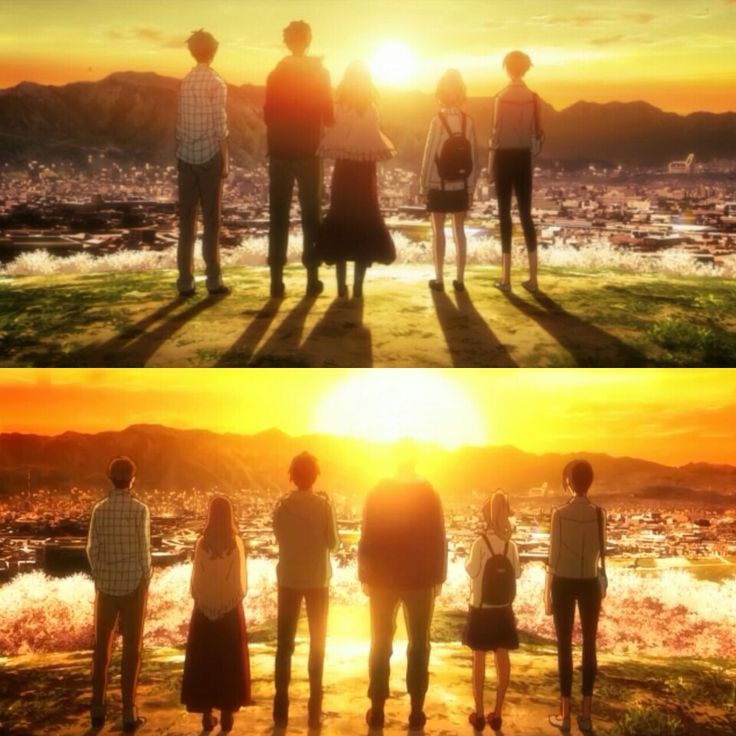

## Introduction

Orange for me at the core is a story about having past regrets, and choosing whether to move on from them or be stuck with them.

Through these 6 friends I feel like I've seen something very deep and relatable in the sense that we all have past regrets, choices we made that we remember from time to time, choices that either broke us or made us someone better than what we were yesterday.

It runs on the idea of what if you got a chance to do something so that you won't have any past regrets? And that's the base that this story builds itself! One thing I'm genuinely happy to say is that how they kept bits of science that makes in this story.

They could have negated elements of parallel worlds and branched timelines to make it more approachable but they didn't and at the end you see nothing has changed and because the world runs on possibilities of choices and you get different world with different choices (maybe it's confusing for some?)

## Pent up feelings

Through Kakeru, I saw a part of myself from the past. A kid who puts up a curtain in front of others, making them believe he's happy. We’re not always shown what goes on behind that curtain, but when he's alone, he overthinks. He blames himself, downplays everything he is, and constantly stays on edge — like he could break any moment. He’s scared to let people in, scared that if he does, he’ll disappoint them. That’s why he kept avoiding Naho, even though he openly said he loved her.

It's not easy to be open about your feelings when you're in a state of shock or carrying guilt that big. Kakeru did exactly what a lot of people do — he smiled and laughed. The moments where he was genuinely happy with the group were real, but then suddenly, there was this shift. He holds back and always thinks, is it okay for me to be happy?

All of it is just pent-up feelings. And honestly, it feels easier sometimes to bear it all alone than to explain it to someone else. That’s what Kakeru did. He let it build up quietly inside until it became too much. That breaking point came when he saw his mom’s messages.

Visually that moment was heavy, because until a point it was said he died from an accident but in reality it was this moment, the breaking, that led him to take that step. And it wasn't easy to watch.

## Naho and friends’ role

As the story mainly focuses on the group of 6 high school students and that is a good base to tell this story about regrets and deep pain. As it shifts between the group’s high school time and their adult time. The bigger role was given to Naho as we see the story unfold from her perspective. We don’t know who Kakeru is, but we get to know about him through the letters she got. And then the whole group.

Although sometimes I felt like she was naive too, I mean it was like you had a whole paper given to you in advance but you still fail because you didn't know what to do with it. But that’s where Suwa comes in, he knows all the situations and everything and handles it all accordingly knowing his future will change quite a lot. As a friend out of them all he did what everyone should do, notice the signs and be there for the person who is suffering. Others, however, did not have much to do in it but just to support Naho and help them have situations so that they can change the future and save Kakeru.

## Signs are there

Here we come to something heavy. There are always signs when someone is going through troubled times, through social media we would not know but to the person in front of them they can see if they want to. This happened a few times with Naho too, in letters she regretted not asking Kakeru questions, she ignored him or ran away whenever there was an awkward situation between them. Then there were her friends too, whenever she talked about how Kakeru looked sad, they ignored that saying “it’s nothing” or “Kakeru will be fine!”, In the main timeline that was the biggest mistake they made, instead of asking directly to Kakeru they assumed he was fine, which led to the situation about Kakeru.

This was one of the biggest regrets in Naho’s letters, that she could not make herself talk with Kakeru when there was a chance for her. And then comes the shock of what Kakeru did, and then the realization of how all the signs were there, of how Kakeru was hurting all along and they could not see this. Which in this timeline they did change through expressing their regrets and guilt for not noticing the signs.

## Sharing Burden

One big issue as humans we all have is how we are not able to express our true feelings, maybe because of a past experience or the peer pressure of not coming out as someone perfect. For Kakeru it was past experience, he was joked about his situation with his family and then about his mother in his previous school, and that’s how he put a curtain, obviously he did not want to be in that situation again, no one would want to. In a situation where he was joked about, where there is a lot of pain. But now there are people who he thought were his friends and he could share his burden with them, but then come the laughs. So to not get into this situation again he chose to not talk about it.

But this time it was different, he could have seen the sincerity in how Naho and the group treated him. But the scars from the past are not easily healed, one blowback and he stepped back again losing all the hope that yes there was a chance for him to express himself and put out his feelings in front of the people he thought cared about him, which Naho knew she did a lot. Big moment being the Firework festival, he cried and told Naho all the things he was carrying. But then again held back, but we can see that he was appreciative of how these are the people who cared about him, how they shared his burden and that’s how the future was changed.

## A Paradox

This is something different from the main theme of the anime’s story but played a big role. We cannot change the future, but what we can do is see the signs in the present and help the ones in need. As the Ancient One said in Endgame, every action creates branches of possible futures. In case of Orange it is shown in the end, where we see the same group, without Kakeru even though in the past timeline they saved him. Now there are 2 timelines, one where they saved Kakeru and one where they couldn’t.

All they can do is accept the reality and move on with their regret, which was the difference between the way Kakeru handled his situation and again for me, it is conflicting too. At one point I do feel like Kakeru was the one who could have changed himself and could have opened himself up, but on the other end Kakeru was acting on his past experiences and same goes for the group.

## Conclusion

Orange tackles very deep and heavy topics that I am still wrapping my head around. As an adult I do understand a few things and as a human one thing I would never do is ignore the signs people I care about give me or express. And I would ask you the reader as well, there is nothing wrong in just asking “How are you?” or “How are you feeling today?” but there might be someone who wanted someone to ask them that.

I would want everyone to watch Orange one time and see the positives out of it, it is not a story that could be watched in a state of a bad mindset but still something that needs to be experienced once.

> Orange is available on Youtube for free, and I highly recommend watching it. It’s a story that stays with you, and it’s worth every minute of your time.

<iframe
  width="763"
  height="315"
  src="https://www.youtube.com/embed/videoseries?list=PLxSscENEp7JhUHB4qUmPjh0pRdyQrQVEB"
  title="YouTube playlist player"
  frameborder="0"
  class="aspect-video h-auto w-full"
  allow="accelerometer; autoplay; clipboard-write; encrypted-media; gyroscope; picture-in-picture; web-share"
  allowfullscreen
></iframe>
