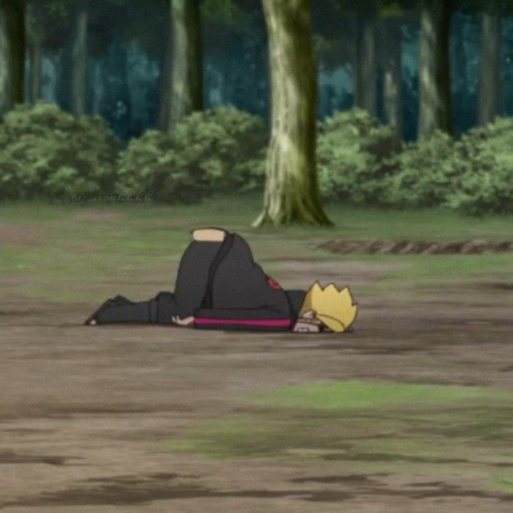

## Introduction

Overthinking — also referred to as rumination — is when you repetitively dwell on the same thought or situation over and over to the point that it disrupts your life.

That's what internet refers to as Overthinking, tho it might sound a bit dramatic but i know most of you would agree

Why i said most of you, is because it's becoming quite common to have the problem of overthinking, you, your friends, your family might at one point have said “I'm just overthinking it”. And it's mentally quite exhausting at times and you wanna get out of but you can't, which becomes frustrating at some point.

## My Situation

How do i try understanding Overthinking? For me it's a stream of thoughts that keep me from thinking anything, this of thoughts is somewhat uncomfortable, a wave of flooding thoughts that takes me to a deep hole, from where it becomes really hard to come back, along the way i feel like I'm in a state where i do dumb things, or end up doing some kind of dumb thing which I will regret later and also might hurt someone.

Well typing out that i ended up overthinking! Isn't that funny.

I don't know when i ended up getting into this situation but i know one thing that everyone who knows me, knows i have this issue and it kinda frustrates them too, which is visible.

And one thing i understood recently that just knowing the problem isn't gonna solve it, it asks for steps to be taken.

## How i dealing with it

How am i dealing with it? Well it's still in the works, but firstly since it happens unconsciously, I'm constantly reminding myself to not think about anything more than 1 minute, well it can be mentally draining and makes me ignore few things.

Overthinking has also quite affected how i function at my work, insomnia combined with overthinking is a draining process and takes a lot of mental toll.

Right now distraction has been the key, one thing helps me is recognising what'll trigger overthinking, that sounds weirds because most of the time it's unconscious, but I'm getting used to it.

Coming to distractions! Work, Talking with people, Watching some calming videos, listening to podcasts, these are my distractions and helped me a lot.

Now these are my distractions and my way of not focusing on tiny details, thus is nothing to be influenced by but trying it won't hurt.

Okay All in all there is always a trigger to things and there is always a way out of things, everyone has different ways to handle things. Some get it hard way and suffer it through to healing. But if you try you can find different ways to get over this and that’s what i do. Hope it helps you in any way!
