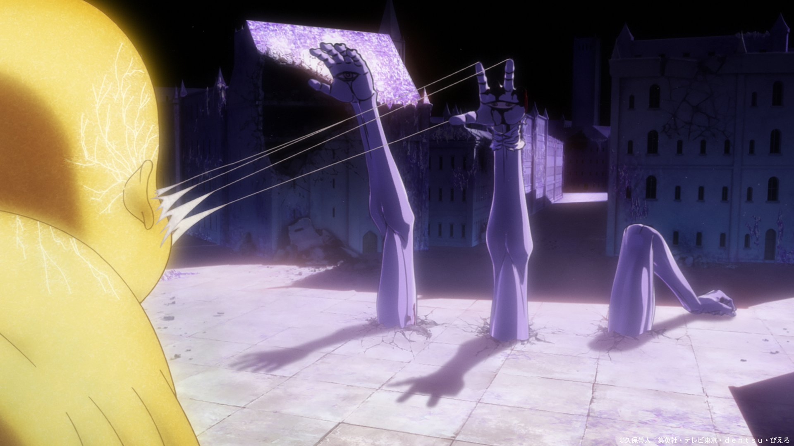

import { Tweet, Vimeo, YouTube } from 'astro-embed'

---

So in the recent Bleach Episode, there was this section where Pernida Parnkgjas, is transforming into Soul King's Left arm. And whole transformation was done in CGI, and this was special because it was done by Asahi Production.

I guess this was first of the collaboration which is part of the Production Alliance between **PIERROT STUDIOS** and **ASAHI PRODUCTION**. It's all part of Pierrot's plan to upgrade their production quality which includes "Pierrot Films" and so far other studios are part of the deal including Asahi Production.

I really wanted to talk about how PIERROT has been working on improving their production quality, and this post of ASAHI PRODUCTION just made me create this post!

Now I am seeing a lot of criticism regarding this specific scene but personally I really enjoyed it and I didn't find any issues, because it's the same thing as MAPPA did with colossal titan. It's nothing new with CGI being used in Anime production!

This is something that can he improved from time to time and good part is Pierrot Studios understand the need of Improvement and this was very much visible the way Boruto: Naruto the Next Generation ended.

Now Pierrot Studios had collaborated with **ASAHI PRODUCTIONS** and **Red Dog Culture House**, in attempt to Improve their production quality and as per Pierrot studio's management they _want to get to level of what MAPPA STUDIOS and UFOTABLE are doing with their production_

And with the creation of Pierrot Films and what they are giving us with Bleach Thousand Years Blood War Arc Cour 3, Things are looking pretty good and good for Pierrot Studio's other productions

#### Links:

<Tweet id="https://x.com/AsahiProduction/status/1860329456746852854" />

[https://news.pierrot.jp/asahi-p/](https://news.pierrot.jp/asahi-p/)

[https://news.pierrot.jp/red-dog-culture-house/](https://news.pierrot.jp/asahi-p/)
