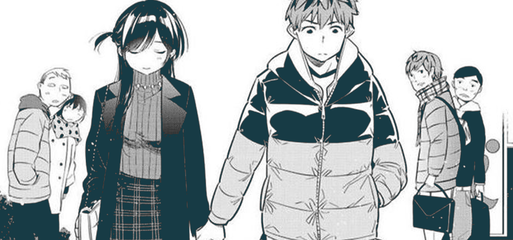
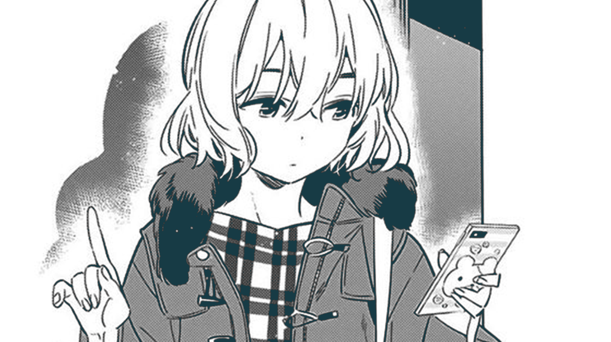
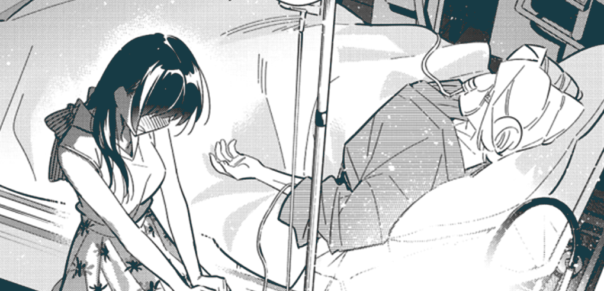
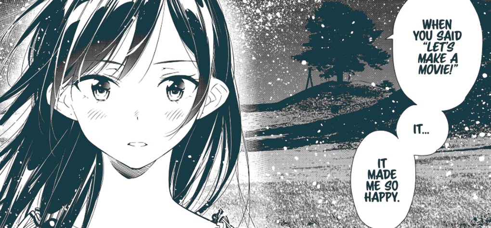
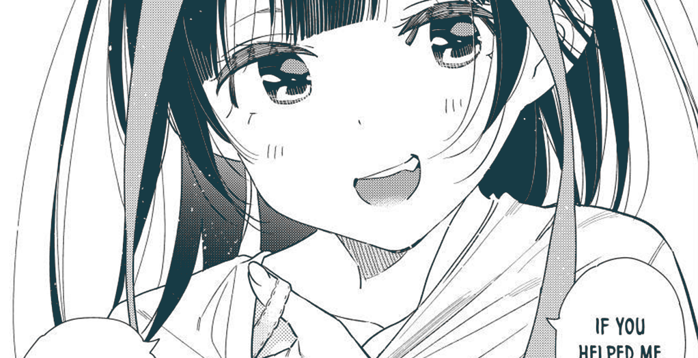
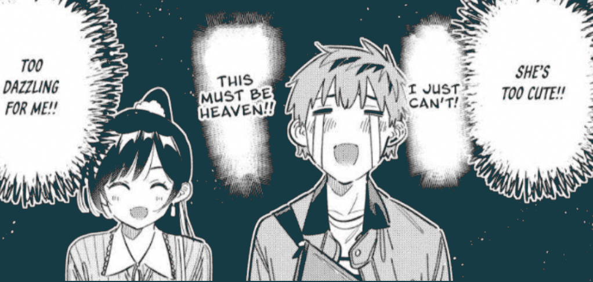

## Introduction

Rent a Girlfriend is a series that has really polarized consumers, there are ones who hate it and there are ones who enjoy it, I don't know where I fit in. I come to this story again and again because of how good it became on a certain point; it's like I have a toxic relationship with it. I know it's bad, I know there is nothing to gain here but still stick with it in hopes that I'll find something, when I lose hope again it gives me certain moments telling me “Hold on! I have something more of what you want”.

Ultimately, it's a story about a guy who's into this concept that's popular in Japan, “Renting a Girlfriend”, something for loners of society who've not found love but are desperate enough to have some moment of affection from a stranger even if spending money while doing that. At the center of the story are 2 characters, Kazuya and Chizuru.

Kazuya is the desperate guy in early twenties who just broken up with his girlfriend and now he's lonely doing “stuff” that someone just out of teenage with broken heart would do. Then he finds out about Rental Girlfriends, out of desperation he rents few girls who become his girlfriend for a day and that's when he finds Chizuru Ichinose.

A divine beauty who was at start very mysterious but as she's the main heroine of the story so much is revealed about her character, and at a point I questioned mangaka Miyajima Reiji, why have such a douch of male protagonist and then there is Chizuru who's really someone ideal as a character. She's someone with dreams and opinions, whereas Kazuya is someone with just Horniness and desperation. And still, we see Chizuru gets these feelings for Kazuya time to time. Although we are shown how she's confused about those feelings, and she wants to understand what she feels about Kazuya.

Now someone who doesn’t know what’s happening in the story will get confused and I am guessing that’s most of the readers of this post. So the thing is with Miyajima sensei’s writing, it can get shallow most of the time and somewhere in the middle of all that mess you can see the depth of what he can do but is not doing. and that’s also the thing that makes me want to come back to this story again and again. There are alot of annoying things in the series but there was one time when I became a fan of Miyajima Sensei, which was during _The Movie Making Arc,_ this arc really was something got me back to Rent a Girlfriend manga.

## Side Characters

Okay! I will get back to that arc later but for that I will have to talk about side Characters. I can say Rent a Girlfriend has some of the annoying and outright bad side characters. In an Ideal story(according to me), side characters are meant to be pillars who help main protagonist improve his/her character but in Rent a Girlfriend that’s kind of reverse. Now when I talk about side characters I am talking the friends of Kazuya and nowadays whenever they are involved I get reminded how I did not like this series.

There are 3 side characters who take story ahead and help Kazuya understand what he is doing wrong whenever he is dealing with Chizuru. That’s the 2 Grandmothers and Mini Yaemori. So from start the grandma of Kazuya was involved and then also comes the Grandma of Chizuru. And it’s these 3 characters who can make you understand how good Miyajima Sensei can be as a writer but he does not. Out of circumstances both grandmas become friends and Kazuya’s grandma makes him understand what kind of person he should be. now after all that comes the best arc of the series and I can say that was the peak of Miyajima Sensei’s Storytelling.

## The Movie Making Arc

**_From here on there are some spoilers!_**

So, From the start we aren’t shown much of what Chizuru is outside of her being a rental girlfriend. unlike Kazuya she has purpose and drive to fulfill her dreams, and that dream was is to become an actress. and we are given reason as that’s why she also became a rental girlfriend as that involved being that out of her personality, being a rental girlfriend means that she has to become someone who can be considered as a lovable person. She fakes herself, that’s the level she wants to go to perfect her art as an actress.

Chizuru’s Grandma knows about her dream to be an actress and she tells her that she wants to see Chizuru on big screen. So when Chizuru’s grandma is hospitalized and she gets to know her grandma does not have much time, she gets this feeling of regret that her grandma won’t be able to see her on big screen as an actress. Kazuya gets to know about this and for the first time in the series we get to see Kazuya being determined about something, we get to see him act responsible. He wants to fulfill Chizuru’s Grandma’s dream and decides to make a movie. and that’s where this whole journey of film making starts. which for me till date are the one of the finest chapters of whole series. and till date I am yet to see something that can considered even a little below that level of excitement and good storytelling.

For me that arc really gave Kazuya a permanent character development, whereas in all other arcs the typical Miyajima comes, who shows a temporary 2,3 panels of Kazuya being a mature human being and then he goes back to fantasizing about Chizuru. which is the most irritating because there will always be one friend of his who comes out of nowhere and puts weirdest thoughts in his head just after he was ready to think seriously about his life and his love for Chizuru.

Now somehow that changes at the end of Movie Making Arc, where we see Chizuru in her most vulnerable state. She cries and talks about all her insecurities and how she feels lonely now that her grandma, her last relative is also gone. That’s when Kazuya comes and out of his character he shows his determination which also changes Chizuru’s perspective of who Kazuya can be. I was also happy seeing that although that happiness does not last long as new arc starts and we are back to square one on who Kazuya was before Movie Making arc.

## Mini Yaemori

Now after all that we again have another character who is like a bright light for this series, Mini Yaemori. She is a neighbor of Kazuya and Chizuru. who is a chill and fun to be with character, someone who knows what’s happening around her and I can say she is like a mirror of audience through which Miyajima sensei is telling us that, yes I know what your complains are but also there are things I want to tell and I will do it! I have noticed many times on how besides Chizuru and Kazuya, Yaemori is a character that Miyajima sensei has put thoughts on, he has worked on her character and what she means to the story. because in the latest arc we are shown how out of circumstances these 3 end up living together and Yaemori becomes a bridge between Kazuya and Chizuru.

She is also unpredictable as Miyajima keeps her as a convenience, like whenever we feel like the story is stalling we see Yaemori coming and moving the story forward. At first I thought she was really just a typical neighbor but as time passed she really became relevant to story in general. besides the Grandmas, she is the only character that really makes sense to this series as a side character.

## Conclusion

I don’t really understand why Miyajima Sensei is stretching Kazuya and Chizuru being together. I mean what Other mangakas did in 60,80 chapters Miyajima Sensei has come to 357 chapters and still has not done yet. A New Arc is started and for the first time they are going on a proper date funnily the arc before it was 10-12 chapters of Kazuya going on a fake date to plan this date and obviously things are not going as they should be.

I don’t know how long I will be able to stick to this toxic relationship with Rent a Girlfriend but yeah I am really invested enough that I might go till end. and I don’t know who really is interested in this post or this series but yeah this was something I planned for long time! To talk about this series.

### Links:

[Anime](https://www.crunchyroll.com/series/G6QWV3976/rent-a-girlfriend?srsltid=AfmBOopGTXBh1YsZKGI9lLLrREKbWbzC3uU2fqn4k7RigexrkJ6mx5x7)

[MangaWiki](<https://kanojo-okarishimasu.fandom.com/wiki/Kanojo,_Okarishimasu_(Manga)>)
