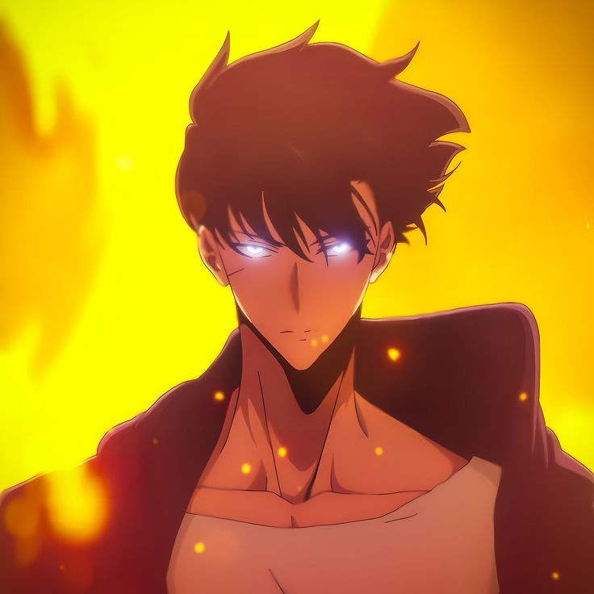
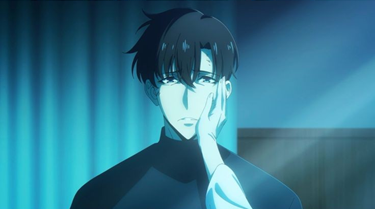
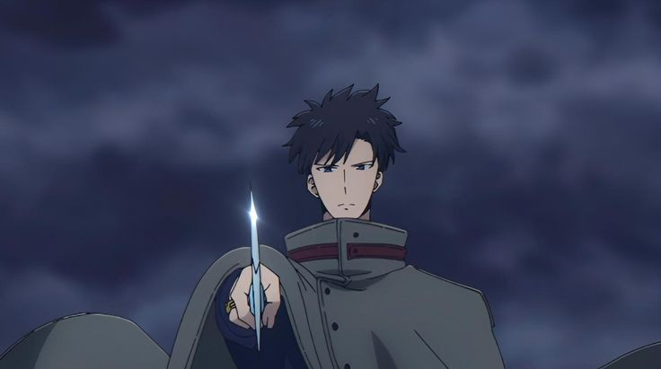
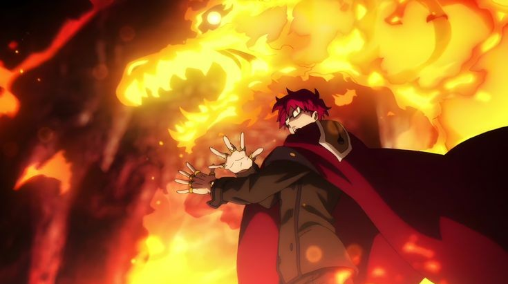
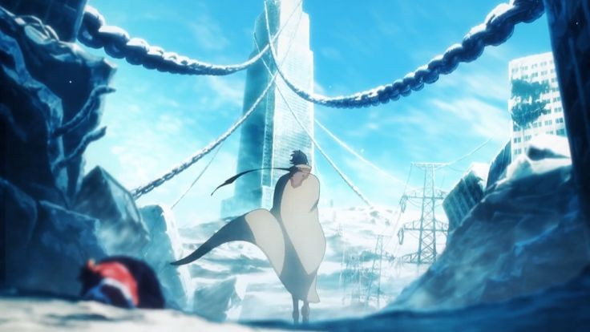
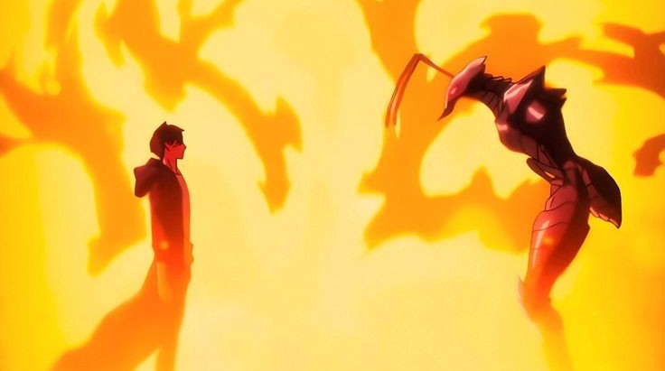
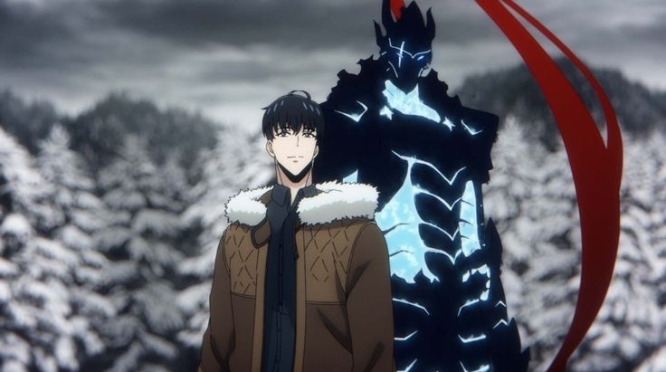

Season 2 of Solo leveling ended and I gotta say, I thought this was gonna be the continuation of the already great Season 1 but animators really enhanced what was to be covered in season 2, as in it really felt like a upgrade to season 1!

All the hype moments and the moments which were needed to be taken care of were done so with care, I know people have complains about sorry and characters but we'll talk about it.

## Novel adaption

Firstly, solo leveling was a light novel which was adapted into the manhwa, I didn't know that untill someone pointed A1 pictures are adapting the novel majorly and taking some parts of the Manhwa, according to internet there isn't much different there but I guess visually it changes things.

Also yes they took liberty of removing few things and adding few scenes, the most I miss is the funny moments between shadow soldiers, other than that I'm fine with it all

## Characterization and Story

A big complain I saw every week is how Jinwoo is really a bland character and story is also straightforward. Sorry to say, but if you also felt the same then you just had wrong expectations from this series.

In my opinion, I haven't any Manhwa that has Very deep meaning story or a multi layered character, Manhwas as I see are meant for excitement and fun, not for finding meaning behind things. There is always this weak character who somehow gets into best case scenario, be it Solo leveling, Lookism or omniscient reader….to name a few.

Still there are some reasons I feel like Jinwoo has become like this, There are moments in season 1, specifically the double dungeon scene where you can see how desparate he was to just drop all and any emotion, just to be alive, and this complain comes in season 2 but it'll makes sense in coming seasons why things just keep happening and he comes out of it without any issues.

As the story progresses, you see Jinwoo just having a goal and system helping him to achieve that goal one after another and yes that might seem like cheating but that also gives us one aspect of this story which will be revealed in future…what is this system? How did Jinwoo get it? And why is he feeling emotionless?

Although you can't say that because throughout season 2 he had a goal to awaken his mother which he did and he also didn't go to Jeju raid because he wanted to be with her, him crying when she woke up, was him showing emotions and it was shown really well.

## Something more than the story and character.

In India nowadays we this term used “Mass”, a mass movie or a mass moment, the idea is to cater to general audience, who doesn't care about story depth or character meanings, they are into it for the moments and excitement.

This audience doesn't want to be preached about life lessons, they wanna enjoy hero winning and beating the hell out of villians and that's where I put Solo leveling, specially Season 2 in. Because yes when Jinwoo switched and got into the Jeju tunnel I was hyped! I screamed a little, I wanted to see it, and enjoy it.

Nowadays we as audience have been so meticulous about trivial things that we have stopped enjoying things and started judging things on micro level, and yes anime has spoiled us with some great stories but we gotta give space to things that are there for enjoyment and not always about finding meaning

Same thing happened with Demon Slayer, the Story is well and good, for its setting and what it wanted to show, but just because general audience liked it, then comes these “nit pickers” who just outright ruin the experience of others. And trust me it does, one negative comment about anything and you yourself will question even once if it's just you who enjoyed this.

## Music

Oh boy! The songs that came in Season 2 are just so amazing! At one point after AOT I felt like Hiroyuki Sawano was stuck with a particular sound, that made you realise just a second in a song that yes this is Sawano, it's good but makes everything in work to be the same!

In terms of Soundtracks, in Season 2 most of it was from Season 1 with some added extras and the variety that Sawano makes, the Songs! Opening was fine for me, somehow LiSA with electronic sound didn't work for me that much.

LiSA with rock hits different, I can't forget the feeling when I first heard full version of Gurenge, I had goosebumps, but in this she wanted something that people could dance to, yeah it takes time to get used to it, it's like she was mellowed down, but good enough.

Then comes Shadowborn! This song gave me feels I didn't think I could get before getting married (that's a dumb joke, please ignore). See I have a special place for a specific chord progression of Major, Major, Major and Minor or other wise. I can and will write a whole post about this song! It has that motivation fact and shows the journey of Jinwoo before and after being the shadow Monarch!

It's a really fitting to his journey! Something like One punch Man got but more impactful to the character! I listen to it twice everyday!

## Action

In one of the interview, staff member said, as Jinwoo becomes more and more powerful they have to keep thinking about unique ways to show that upgrade in his fights! With every fight you get a next level of jump in action, best example was Jinwoo vs Beru, although I'll say it wasn't my most favourite but it shows, how powerful and on what level he is at that time in story.

A1 pictures have gotten their hands on some of the best action Animators and it was visible! That's the thing, SL deserves. Action needed to be the main point of series, they had to nail it and they did, and as a manhwa reader, I'll say its gonna get more and more ridiculous!

## Conclusion

Well I'll just say, Solo leveling is something to enjoy and not think about it much. I've seen reports about comittee having ordered specific amount of Episodes and then dividing them into 2 seasons, so now they haven't started working on Season 3, but I'll say they will get to it obviously, because yes it's been loved.

