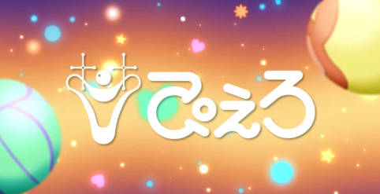
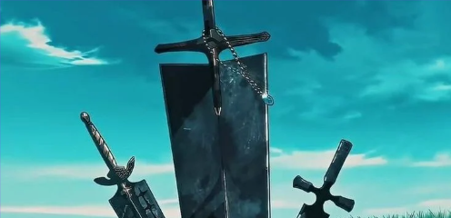
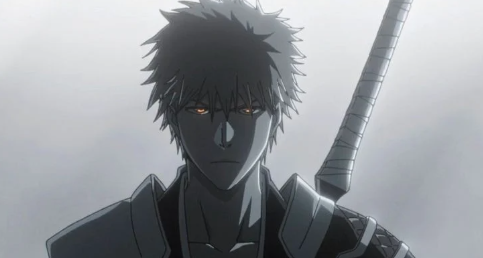
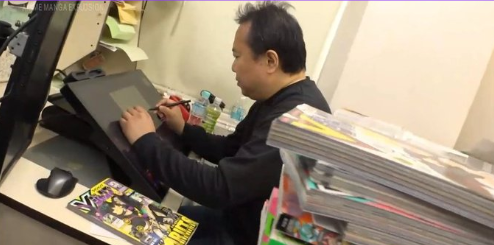
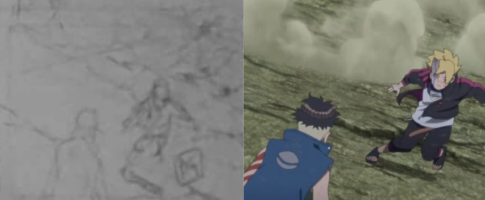
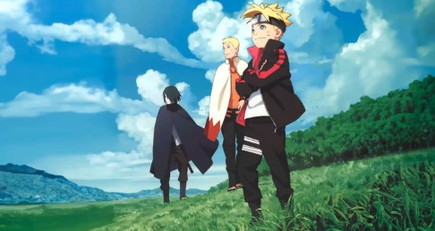

So NHK runs a show called "Anime Manga Explosion", in which they cover different studios and outlets that handle different aspects of Anime and Manga, this time they are converting Pierrot Studios. But with that there is somehow a bit of misinformation circulating that needs to be cleared.

Now these all are also my speculations and I might be wrong too, but I think as far as I know online specially on X people are taking it out of proportion.

## Pierrot Films

Pierrot Films was announced with the announcement of Bleach TYBW: The Conflict, around that time, SP was going a bit of turmoil, Black Clover Anime was on hiatus, Boruto NNG was going on Hiatus and then there was Cour 2 of Bleach TYBW which was criticised, specially for it's action sequences and inconsistency.

When Pierrot Films was announced, it was said to be started with a mindset of creating media that's recognised globally and to produce the same quality as Mappa or Other giants and that's what Yoshihiro Tominaga, the producer of Bleach and handler of Pierrot Films said. In the Episodes he mentions how they spread the Production cycle for more than a year to have a good schedule, which helps animators provide a high level quality and consistent product.

Out of this came a big misconception that Pierrot Films was only created for Bleach, and here's what I think. They wouldn't create a whole sub brand just to handle a single IP, from their own words it's visible they want to create a system, a process that helps them produce high quality and consistent anime.

I'd say, their current focus will be on completing Bleach, which they will with Cour 4 and then they'll surely move to other IPs. With all the learnings and this new production line that they have setup they can give a high quality anime. Again that doesn't mean Pierrot Films is just all about Bleach. In their initial announcement, it was said their first outing will be Bleach TYBW and that's where I am coming from.

## Boruto Anime return

The biggest news flash that came from the NHK episode was a segment where Masayuki KOUDA is seen working on something, and on his desk there are VJump editions including Boruto. And based on that people started assuming that he is working on Boruto anime Part 2 and then these News Pages started making posts about how Production on Boruto anime is ongoing.

See, in the whole episode whenever there was some production material involved everything was BLURRED, Be it the school segment or Bleach Segment. KOUDA SENSEI shows some old Naruto anime material, and that's it! These type of episodes are going through alot of people just to check if by mistake they are not revealing anything.

Boruto anime return will be a big deal and they wouldn't want it's production related stuff to be revealed just like that! The thing about what KOUDA SENSEI was drawing was debunked already, where he was just drawing a frame from Boruto Episode 293, and I'm assuming it was all just for filming to make it lool like he was doing something there. And about the Boruto TBV manga being on his desk, it's clear that every Boruto Staff is keeping up with TBV. Sekibeing and Jay1Jay1Jay1 from time to time post something from new Chapters, so Obviously KOUDA SENSEI would be reading it. And that's where I'm assuming the Mangas on his desk come from.

People on Internet, specially fans will want to assume just anything based any little detail they can get, and when one person does this posting on X or Instagram others will follow, and showing excitement is good but that creates a chain of misinformation which is not good!

I hope with this some things are cleared, and the episode is available for free on NHK site, so if you can go watch it! Personally I was happy seeing Pierrot Studios, and how they work. Specially the School segments, since it was created by the original founder and now it's handled by his Daughter.
