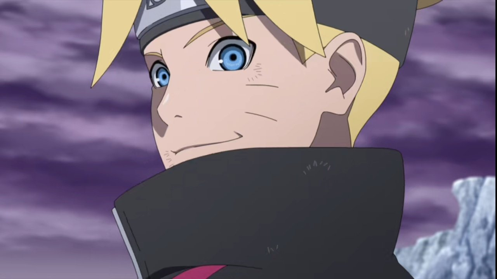
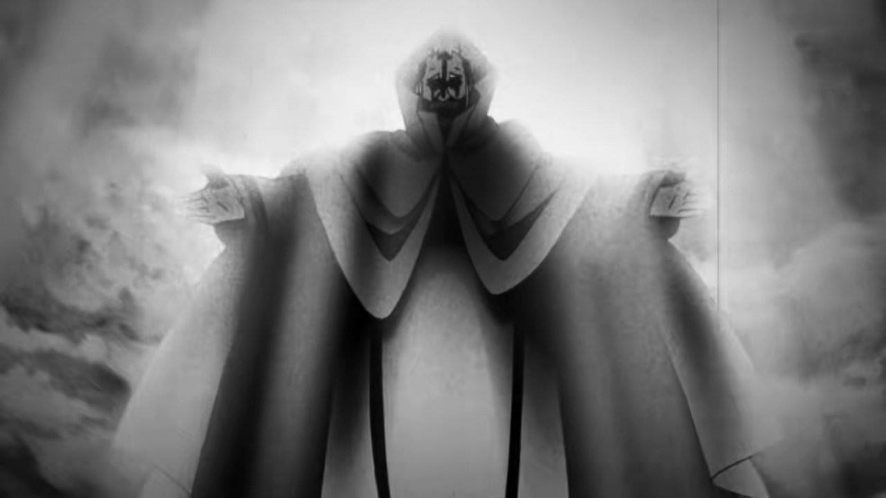
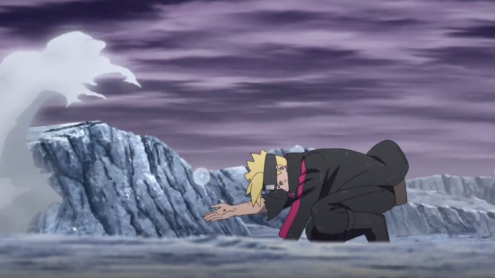
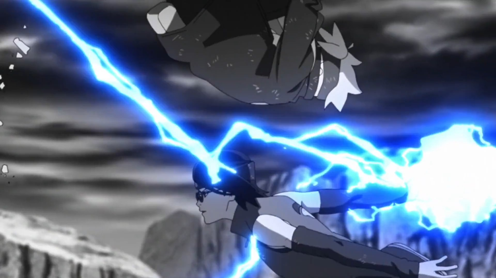
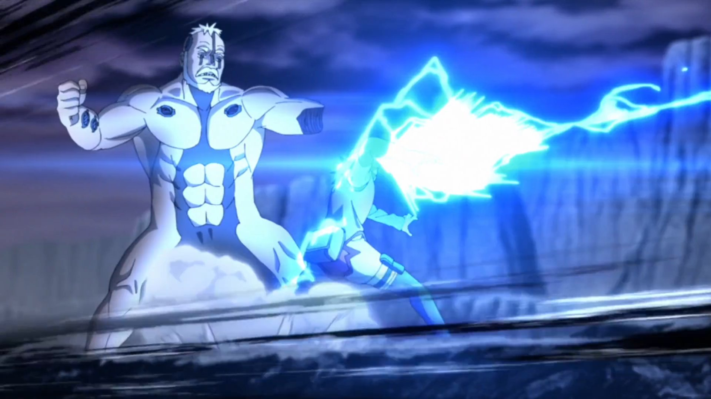
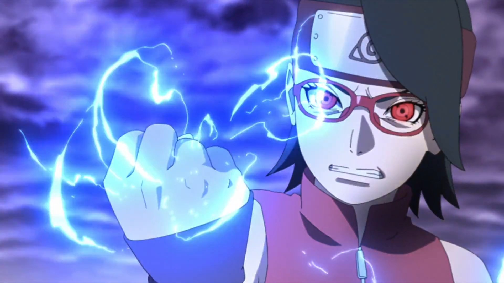

## Introduction

So I'm gonna talk about one of my favourite fights from Boruto Naruto Next Generation, it's the Team 7 vs Boro. This fight is one of those where you can see how Next Generation fights with next Gen villians, You have good team work but no upper hand, hand signs, viruses, oh and Sarada's Chidori

## Buildup

The fight happens when Jigen Traps Naruto in another dimension after Naruto, Sasuke vs Jigen, Sasuke ran away, but exhausted so they can't teleport. Boruto and Kawali use their Karma to open a Portal and team 7 ends up being a rescue team to get Naruto Out of that dimention.

We have Boruto, Mitsuki, Sarada and newly joined Kawaki. Here they do find a bowl that has Naruto trapped but Boro, an inner of Kara is sent by Jigen to make sure no one gets Naruto out of there.

## Boro

Boro is the baddy of this fight, a cult god and part of the inner circle of Kara(an org created by Jigen), he is one of the cyborgs that were created by Amado, well not full cyborg but basically enhanced human with different abilities given by Amado, these abilities are nasty enough he was playing around with team 7.

He has strong body and still can move swiftly, he could also use ninjutsu which was shown when he was constantly using hand signs to regenerate himself whenever team 7 gave him a good blow.

At some point he created these acids from different releases which prevented Sarada from using fire release, and also created this black mist that had virus that paralysed team 7. And since the black mist was created with physical matter using the scientific tools given to him by Amado, the Karma was useless too. So overall Boro was nasty guy to deal with.

## Counterattack

Now, they dealt with Virus by Mitsuki making antidote (he's also somewhat a cyborg created by Orochimaru) but main problem was Bro's physical strength and him regenerating himself even when half of his body was blown up by Kawaki’s Karma. Now through Kawaki Sarada found out that there should be a core that helped Boro regenerate.

And whole Boruto, Kawali and Mitsuki fought, she focused on what Boro was doing, by which she realised that using hand signs Boro was moving his core inside his Body so that even if his body was shattered he could regenerate using the core!

To fight this they needed to find the precise location of Boro’s core and attack him fast enough so he can't use hand signs and move the core.

## Sarada’s Chidori

All that was build up and desparation for Sarada to use this new technique that Sasuke taught her. A technique that only UCHIHA's with Sharingan can use because it was fast and required precision. And she believed in her strength to use Chidori, he first time just after she decided to get powerful enough to help Boruto.

Okay this could hurt some, but Sarada’s first Chidori was the best Chidori I have seen in Naruto Frenchise. She was so fast that Mitsuki and Kawali didn't realise what got past them, it's just through the noise Mitsuki realised it was Chidori.

## Boruto setting stage for Sarada

Now here's my favourite part of this whole fight, Young lord being himself, he quickly realised what was happening and setup the stage for Sarada, he made Boro incapable enough to not realise that Sarada was coming for him and even if her realise it he couldn't do much, all of this just by Boruto looking behind him to see Sarada is coming.

So Kawaki and Mitsuki are behind and looking at Boruto and Boro fight hand to hand, just when Sarada was coming Boro punched him and just as we was flying he saw Sarada coming, here he used Smoke bomb to firstly blind Boro, through smoke Boro tried punching him, but Boruto used his vanishing rasengan to blitz Boro’s left hand. All while he is between Boro and Sarada.

Boro didn't realise what happened since he didn't knew about Vanishing Rasengan and just the. Boruto did back flip for Sarada to Chidori Boro and get his Core right from his body and in a badass move she crushes the core!

## Animation

All this happened in Boruto NNG Episode 207, in 2021, and it was all in middle of a greate stretch of Episodes staff was putting out, Just before this Naruto,Sasuke vs Jigen happened which was again one of the best fights happened in Naruto Frenchise.

We have seen Chidori happening so many time, but for me personally this was the first time they showed how fast a Chidori can be. All while fleshing out few panels, Naruto/Boruto staff is one of the finest when it comes to properly adapt manga panels(sure we can't ignore they have poorly adapted alot too).

In manga we aren't shown that Sarada was practicing Chidori with Sasuke, so it happens abruptly but in anime we do get a glimpse that Sasuke was ready to teach her something that only UCHIHA's can do and it's something really powerful.

It was a full in house episode with a great team that was growing up with the series while seniors helped these up and coming Animators to shine, I don't know many of them, but I see Ken Imaizumi, Huang, Jay1Jay1,Masaaki Endō, Kumiko Katō, who I know are best of the Boruto staff, of course there are many amazing Animators IDK here.

## Conclusion

Overall, the fight between Team 7 and Boro was a fantastic display of teamwork, strategy, and character development. Each member of Team 7 played a crucial role in overcoming the challenges posed by Boro, and the animation quality truly brought the fight to life. Sarada's Chidori, in particular, was a standout moment that showcased her growth as a ninja and her determination to protect her friends. The episode not only delivered on action but also deepened our understanding of the characters and their relationships. It's moments like these that make Boruto: Naruto Next Generations a worthy successor to its predecessor.

## References

  <iframe
    src="https://www.youtube.com/embed/srtMTfh4e4M"
    title="YouTube video player"
    style="position: absolute; top: 0; left: 0; width: 100%; height: 100%;"
    frameborder="0"
    allow="accelerometer; autoplay; clipboard-write; encrypted-media; gyroscope; picture-in-picture; web-share"
    allowfullscreen
  ></iframe>

