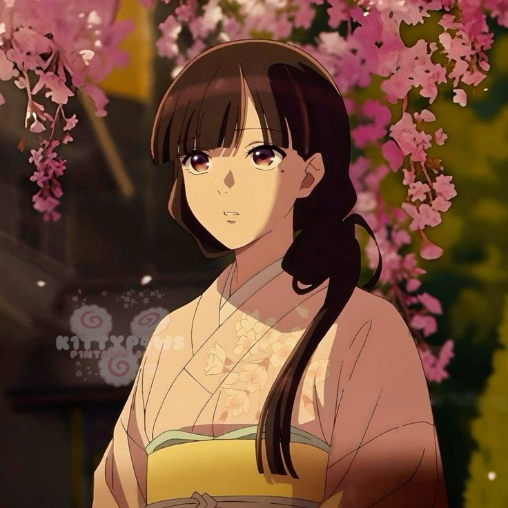
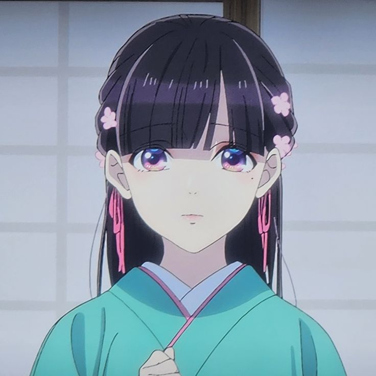
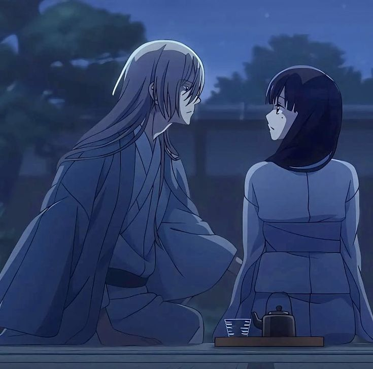
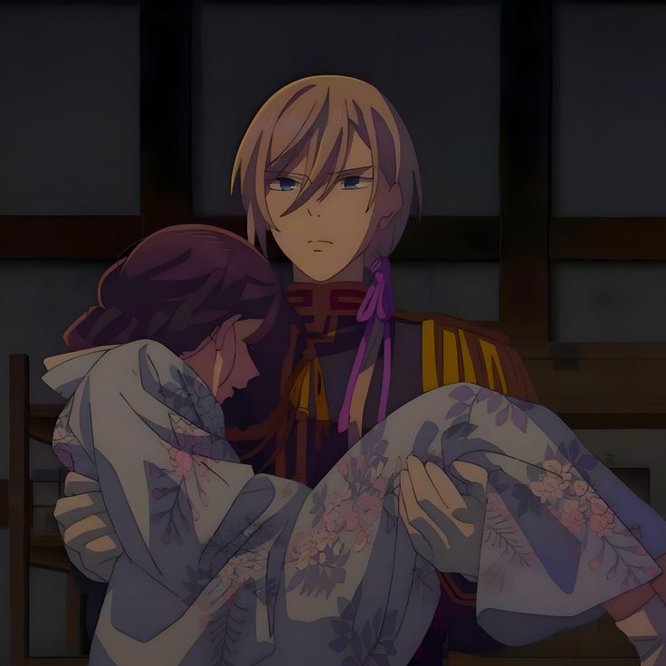

## Disney princess in a Different setting

At first it felt like a Disney Princess story set in old Japan, that's the whole first episode there, story build up on what the main character has gone through and why she's like the way we are shown.

Then comes the husband, who well at first made it more like a Beauty and a Beast setting, from there slowly we get into how the world is working in this story and that's the core of whole story.

## Political Marriages

Political Marriages were a big thing in the past, and the series makes it's base on it really well. From the first episode itself weare given the context on how different families are handling the monopoly of bloodlines to get power in their hand

I won't give away any major spoilers but lookout for some good political drama regarding this concept

## Chemistry

The main thing people lookout for in a romance show is the chemistry between two main lead.

We are mostly looking from the perspective of Miyo Saimori as she starts ger journey with rumoured “brutal” army general Kiyoka Kudou.

So as Miyo gets to know about Kiyoka, we as audience also get to know about him, at least for some part.

Tho it is already visible that dude is soft in some corner and not harsh as he was portrayed.

While Miyo is getting used to the new life, Kiyoka gets to know about her past and tries to show her the world that her family never showed her, he tries to give her warm feeling that she wanted from her family but never got.

Which is also really good to see, how they are trying to make eachother happy through little notions, and make other person happy

## Conclusion

As a romcom, romance anime fan, it was a treat watching this show, yes it does get typical and confusing on parts here and there but overall a good experience, do give it a try
