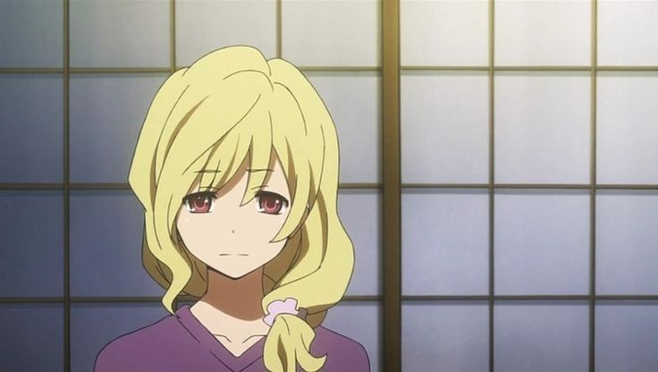

## Introduction

Just finished ToraDora, I had to take break inbetween but finally i finished it. It's kind of a love hate relationship but I can see why people love it. There is a charm in slow burning feelings, and long build ups.

Just to be noted, I wrote the post with all the thoughts that came to me, so it can have minor spoilers, although I tried my best to not explicitly mention anything.

## Ever-changing Feelings

It starts with a promise to help get eachother close to their own crush and ended up having feelings for eachother, almost typical but shows how much human feelings change their experiences grow.

Taiga tried really hard not accepting her feelings, her friends had to push her to accept her feelings for Ryuuji, who also had struggles with his feelings for Minori.

Most of the times it's not easy to accept you might not get to be with someone you had feelings for, which the series showed really well with every confession. Having feelings for someone in itself is painful and when you are hit hard with the truth that other person can't reciprocate the same feelings, that does shatter a part of heart.

The whole arc of Kitamura with Sumire, was so realistic and brutal. His struggle with accepting the he can't be with the person he looked up to, cared about the most and loved the most was shown so well! It was the highlight for me. Him colouring his hair is something I have seen irl too! Broken hearts do weird things.

## Resolve over feelings

Okay this is for Minori, throughout 23 episodes she was the most mysterious person in terms of her feelings (for me atleast). She kept on doing things and worked hard, her rejecting (not literally) Ryuuji showed a serious side of her which was given us in pieces throughout while she kept a happy and energetic shade over her, which no one noticed besides Ami.

At the end they show what drives her to work hard, a dream to complete, something more to look forward to. She was hurt, she liked Ryuuji too but her resolve for Baseball and fulfilling her dream became more powerful than her feelings.

## Responsibilities

Throughout the story one more character which I had mixed feelings for Yasuko (Ryuuji’s mother). On one hand she was totally dependent on Ryuuji, but on the other hand, she knew what kind of man she wanted Ryuuji to be, which her parents agree.

In ToraDora adults did not have much of a role, those who were around were either irresponsible or didn't understand the feelings of these kids.

Part of what made Ryuuji relatable for me was the way he took on the responsibilities. He was totally aware of what her mother was going through to make his life better, he took care of everything so she could work and relax while at home, (his love for cleaning just hit the heart!).

Responsibility is also the thing that made Taiga annoying for me on a level, she always acted on her own, whereas others had to come help her. That was until the last 2 episodes, she acknowledged it, she didn't like the way she was acting, and that was enough for me. But yes the slow burn before that doesn't help.

Almost every character knew what type of responsibility they carried and acted accordingly, which again made it more close to reality, we humans live by responsibilities and sometimes acting on our feelings. Taiga was mix of that, she cared for people around her, fought for them.

## The growth throughout the Story

The biggest plus point of ToraDora was how every character had their character growth moments. Ryuuji learnt to share his burden. Taiga opened her self to accept his feelings, which Minori also did too. Kitamura accepted the reality and moved forward. Ami was the weird one, I never understood her role in it all.

After the anime ended and I thought about it, that's what I remember, how all characters were at the start and how they ended up at the end, you can see them growing up be someone amazing.

## The Flaws

It drags too much, starts real slow, keeping every character’s feelings in dark. Ryuuji was the only character that showed what he felt. They built up too much over the season and wrapped up everything in 3 episodes. You are suddenly moving from one emotion to other, and everything is sorted out easily, that's what I felt for someone else it might not be the same.

And more exhausting part was how every character kept moving with their feelings without expressing them, I begged for someone to express their feelings, and when Kitamura did it was devastating (which is not a flaw though). I don't know what to say but yeah ToraDora did leave me with a unsatisfactory feeling, but that's how I want RomComs to be, I mean my standards come to Horimiya which had it's characters live out their relationship days.

## Some Technicals

Toradora had that classic romcom anime style, beautiful and expressive, throughout the series we get some really guild cuts and it shows how much carefully any scene was made. VAs did really really amazing job, specially the VA for Taiga, her voice and dialog delivery were in point to her size (lol)

Background music was part of what really enhanced the experience, little typical with violin and piano but it hits where it was needed.

## Conclusion

ToraDora was something different from my usual watch, some characters I related so much, some characters irritated me so much. But it is not bad I'm any sense, showing human emotions already isn't easy, although I wish we could have gotten more from Taiga and Ryuuji as a couple.

All the season went through just to make them understand their feelings, but how they go as a couple is something I wanted more of. At the end it was a satisfactory conclusion.
